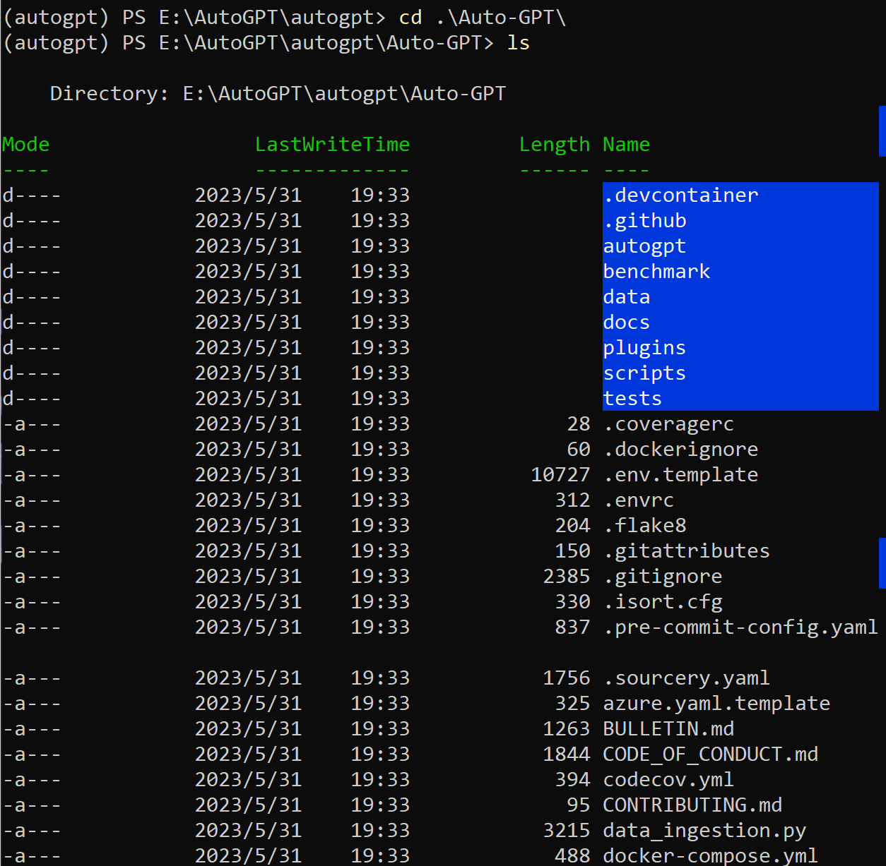
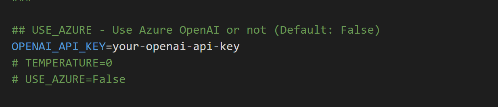
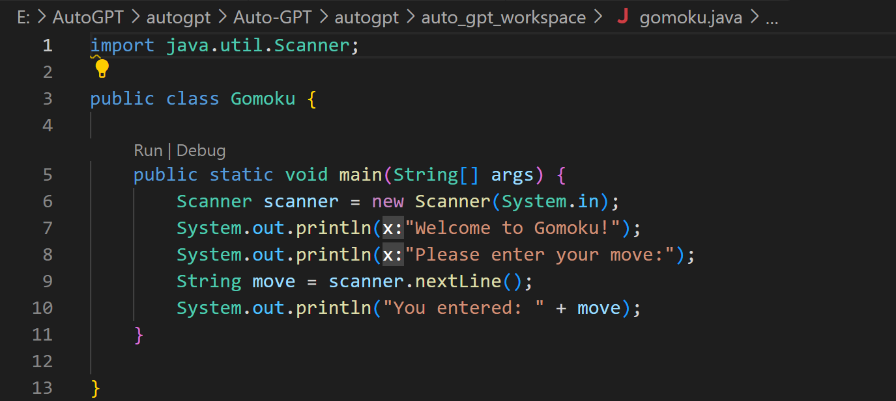

# AutoGPT体验

## 安装AutoGPT
我使用虚拟环境来创建这个项目，所以首先要激活虚拟环境，然后安装AutoGPT，安装完成后，就可以使用了。

在cmd输入下面内容
```bash
pip install virtualenv #安装虚拟环境
virtualenv autogpt #创建虚拟环境
cd autogpt #进入虚拟环境
.\Scripts\activate #激活虚拟环境
```

常用命令
```bash
deactivate #退出虚拟环境
activate #进入虚拟环境
```

删除虚拟环境
```bash
rmdir autogpt
```
官方推荐python`3.10`以上版本，我使用的是python`3.11.3`版本，

在这里我使用的是命令
```bash
virtualenv autogpt --python=python3.11.3
#创建虚拟环境，指定python版本为3.11.3
```

需要注意，如果你的电脑上没有`3.11.3`版本的python，那么你需要先安装`3.11.3`版本的python，然后再创建虚拟环境。

接下来，安装AutoGPT
在cmd输入下面内容
```bash
git clone -b stable --single-branch https://github.com/Significant-Gravitas/Auto-GPT.git
```


安装依赖
```bash
pip install -r requirements.txt
```

接下来我们要对AutoGPT进行一些配置，在文件内有.env.example文件，我们需要将其复制一份，并将其命名为.env
在.env文件内找到`OPENAI_API_KEY`，将其改为你的OpenAI API Key，如果没有的话，可以在[OpenAI官网](https://beta.openai.com/)申请一个，申请成功后，将其填入即可。



## 运行AutoGPT
在cmd输入下面内容
```bash
python -m autogpt
```
就可以启动Autogpt了

但是，经过了我一晚上的测试，我发现这个AutoGPT还存在许多不足
### 第一次尝试
在我的第一次测试中，我请求他给我用java写个下棋游戏，在一番搜索之后，他卡在了配置java环境这一步
他一直对甲骨文发出请求，企图下载jdk，但是因为没有甲骨文账号，被甲骨文官网一直屏蔽，
导致了死循环
更令人哭笑不得的是，我的电脑上早早就装好了jdk


### 第二次尝试
在第二次测试中，我为了避免他的错误，对提示词进行了升级
我提示他jdk和开发工具已经安装完毕。

这次它稍微聪明了一点，终于写出了一些代码，但是，他写出的代码是这样的


消耗了我1刀就得出个这么个结果，还是由我来组成这1刀吧😀

## 结语
我觉得仅仅调用api就能做出这样的东西，已经很不错了，毕竟这是一个开源项目，而且还是一个刚刚起步的项目，我相信他会越来越好的。同时也感谢开发人员们的辛勤付出，希望这个项目越做越好，能早日做出我的下棋游戏（
