 ---
title: "Flask学习"
date: 2023-05-06T22:00:08+08:00
draft: flase
cover:
    image: "python-flask-logo.jpg" #图片路径例如：posts/tech/123/123.png
    caption: "" #图片底部描述
    alt: ""
    relative: false
---

# Flask学习

## 1.1 配置环境与访问
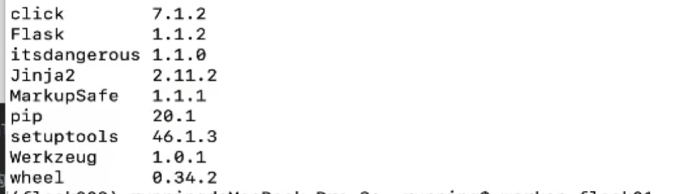

1. 配置环境
```bash
cdvirtualenv 进入虚拟环境
rmvirtualenv 删除虚拟环境
lsvittualenv 列出虚拟环境

```

2. 自己安装：
进入终端中进入虚拟环境----->
```bash
pip list
pip install pymysql
pip install flask==1.0(卸载原来的版本，安装指明的版本)
```
3. 项目结构介绍：
```bash
--项目名：
|---static (静态)js css
|---templates(模板)
|--app,py（运行引启动）
```


新建Flask项目
```python
from flask import Flask

app = Flask(__name__)


@app.route('/')
def hello_world():  # put application's code here
    return '哈哈哈'


if __name__ == '__main__':
    app.run()
```

**路由 URL [http://127.0.0.1:5000](http://127.0.0.1:5000)**

**WSGI: Python Web Server Gateway Interface 是为Python语言定义的Web应用程序**

**Flask内置服务器 nginx**

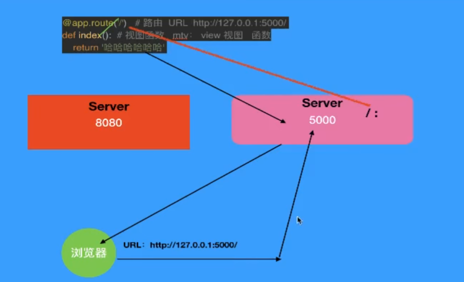

`app = Flask(__name__)`

run(host='ip地址’，port='端口号')

ip地址，一个端口号对应的是一个程序

[http://192.168.1.5:5000/](http://192.168.1.5:5000/) 如果host改成: 0.0.0.0 外网可以访问默认情况下只能是本机。

app.run(host='0..0.0',port=5001， debug=True)
debug: 布尔类型的
debug=True 开启了debug调试模式 只要代码改变服务器会重新加载最新的代码
debug=False 默认 代码发生改变不会自动加载 适用于production环境

**注意！这一步在Pycharm可能有坑！**

## 1.2 Flask请求响应

可以另起settings来实现ENV环境

设置
设置配置文件：
`settings`
配置文件
```bash
ENV 'development'
DEBUG True
```

路由的请求和响应：
浏览器地址栏输入的内容：[http://192.168.1.5:8000/index](http://192.168.1.5:8000/index)
----> 服务器 ----->app-----> 有没有这个路由
----> 就会执行路由匹配的函数------> return'heLL0 world'
-----> response------> 客户端的浏览器

请求：request
http协议：
request请求
请求行：
请求地址：[http://0.0.0.0:8000/index](http://0.0.0.0:8000/index)
请求方法是什么？  method:get post
请求头：  key:value
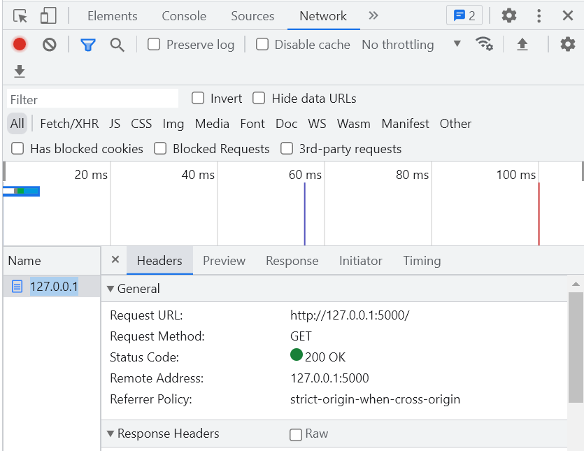
```bash
Accept:
text/html,application/xhtml+xml,application/xml;q=0.9,image/avif,image/webp,image/apng,*/*;q=0.8,application/signed-exchange;v=b3;q=0.7
Accept-Encoding:
gzip, deflate, br
Accept-Language:
zh-CN,zh;q=0.9
Cache-Control:
max-age=0
Connection:
keep-alive
Host:
127.0.0.1:5000
Sec-Ch-Ua:
"Google Chrome";v="113", "Chromium";v="113", "Not-A.Brand";v="24"
Sec-Ch-Ua-Mobile:
?0
Sec-Ch-Ua-Platform:
"Windows"
Sec-Fetch-Dest:
document
Sec-Fetch-Mode:
navigate
Sec-Fetch-Site:
none
Sec-Fetch-User:
?1
Upgrade-Insecure-Requests:
1
User-Agent:
Mozilla/5.0 (Windows NT 10.0; Win64; x64) AppleWebKit/537.36 (KHTML, like Gecko) Chrome/113.0.0.0 Safari/537.36
```
response
响应
响应行：状态码
200 ok,404 not found,500 服务器端错误(Server Internal Error),302 状态码302表示重定向。它是指请求的资源已被分配到新的URL上
```bash
响应头
Content-Length:18
Content-Type:text/html;charset=utf-8
Date:Mon,18 May 2020 08:57:02 GMT
Server:Werkzeug/1.0.1 Python/3.7.4
```
响应体：
```bash
<font color="red">Hello World333333!</font>
```
<font color="red">Hello World333333!</font>

## 1.3 Flask的路由和变量规则

settings配置
```bash
ENV = 'development'
DEBUG = True
```

另配置文件生效
`app.config.from_object(settings)`

route就是路由
```bash
def index():
    return 'welcome everyone!'

app.add_url_rule('/index', view_func=index) #这两行代码表示内容相同
```

```bash
route:
def route(self,rule,**options): 
    def decorator(f):
        self.add_url_rule(rule, endpoint, f,**options) 
        return f
    return decorator
```

这个装饰器其实就是将rule字符串跟视图函数进行了绑定，通过`add＿url＿rule()`实现的绑定
```bash
@app.route('/index')
def index():
    return 'welcome everyone!' 
```


```bash
data = {'a' : '北京','b' : '上海','c' : '深圳'}

@app.route('/getcity/<key>') #key就是一个变量名，默认是字符串类型的
def get_city(key):
    print(type(key))
    return data.get(key)
```
**在浏览器中输入 [http://0.0.0.0:5000/getcity/a](http://0.0.0.0:5000/getcity/a)  打印出北京**

**同理，输入 [http://0.0.0.0:5000/getcity/b](http://0.0.0.0:5000/getcity/b)  打印出上海**

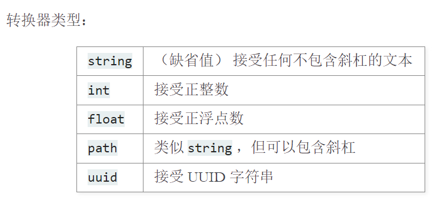

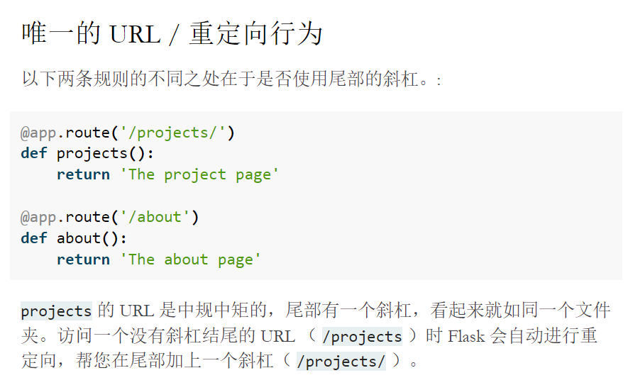

```bash
@app.route('/add/<int:num>')
def add(num):
    result = num + 18
    return (result)
```
进入[http://0.0.0.0:5000/add/15](http://0.0.0.0:5000/add/15)
此时会报错，在DEBUG页显示

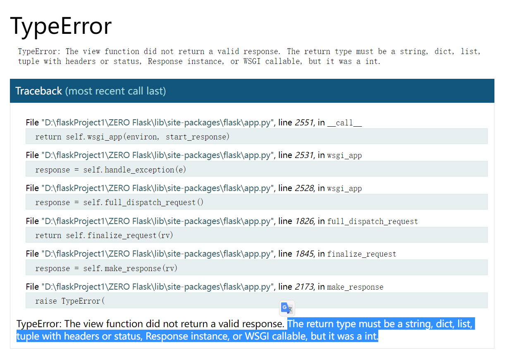

返回类型必须是字符串、字典、列表、带有标题或状态的元组、响应实例或可调用的 WSGI，但它是一个 int。

则我们需要把`result`进行转换
```bash
@app.route('/add/<int:num>')
def add(num):
    result = num + 18
    return str(result)
```
进入[http://0.0.0.0:5000/add/15](http://0.0.0.0:5000/add/15) 

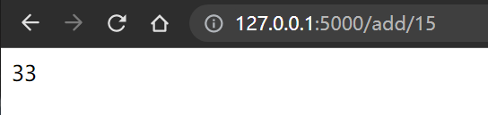
**正常显示**

## 1.4 Flask的变量规则和相应对象

```bash
@app.route('/add1/<float:money>')
def add1(money): #注意！是add1！！！
    print('--->', type(money))
    return str(money)
```
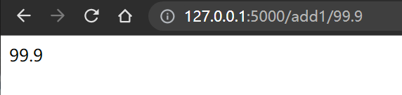

```bash
@app.route('/index/<path:p>')
def get_path(p):
    print('--->', type(p)) #p是字符串(str)类型的
    print(p)
    return p
```
进入  [http://0.0.0.0:5000/index/first/a1/111](http://0.0.0.0:5000/index/first/a1/111)

得到

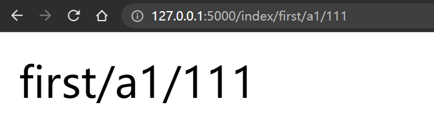

```bash
@app.route('/test/<uuid:id>')
def test(id)
    print('#####>>>',type(id)) #传值要符合uuid的格式才行 uuid模块 uuid.uuid4()----->UUID类型
    return '获取唯一的标识码'
```

```bash
import uuid

uid = uuid.uuid4()
print(uid)
print(type(uid))

uid1 = str(uid)
print(type(uid1))
uid1 = uid1.replace('-','')
print(uid1)
```

进入  [http://0.0.0.0:5000/test/](http://0.0.0.0:5000/index/first/a1/111)

### 路由的变量规则：
string |（缺省值）接受任何不包含斜杠的文本
int     接受正整数
float   接受正浮点数 
path    类似 string，但可以包含斜杠
uuid    接受 UUID 字符串

```bash
@app.route('/getcity/<key>')
def get_city(key): #参数是必须添加的
    return data.get(key)
```

### response对象

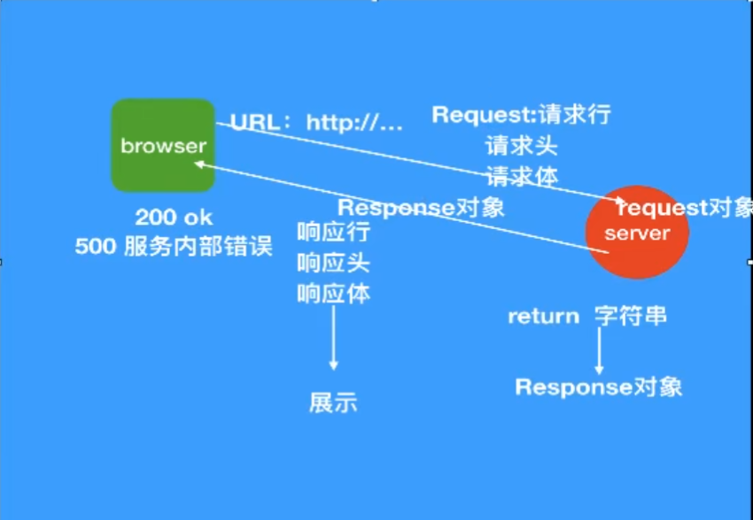


return 返回的字符串其实是做了一个response对象的封装，最终返回的还是response对象

```bash
from flask import Flask

app = Flask(__name__)

@app.route('/index2')
def index2():
    return 'hello', 200
```

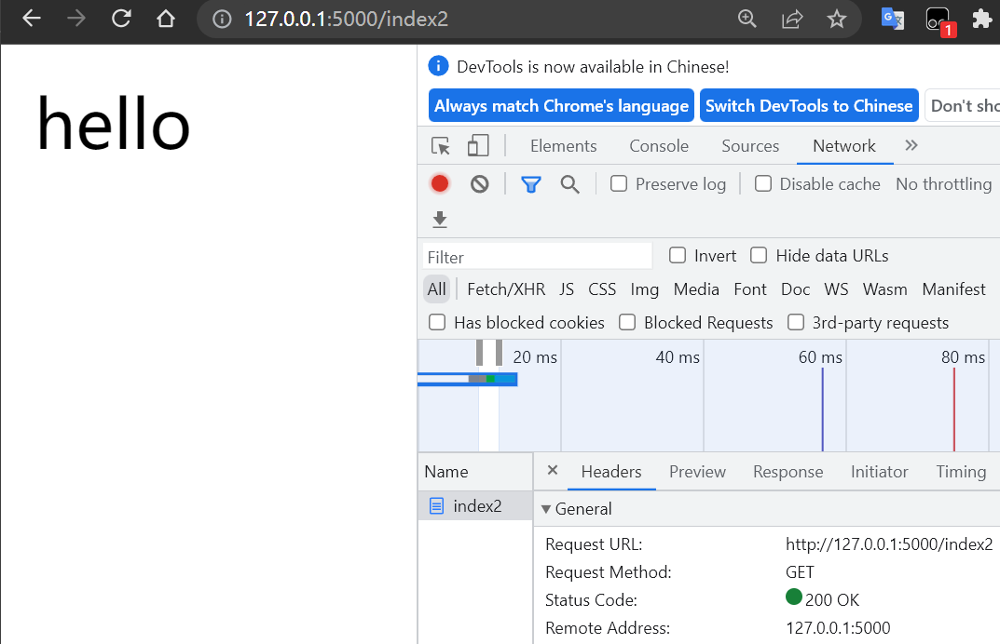


```bash
from flask import Flask

app = Flask(__name__)

@app.route('/index2')
def index2():
    return 'sorry!page not found!', 404
```

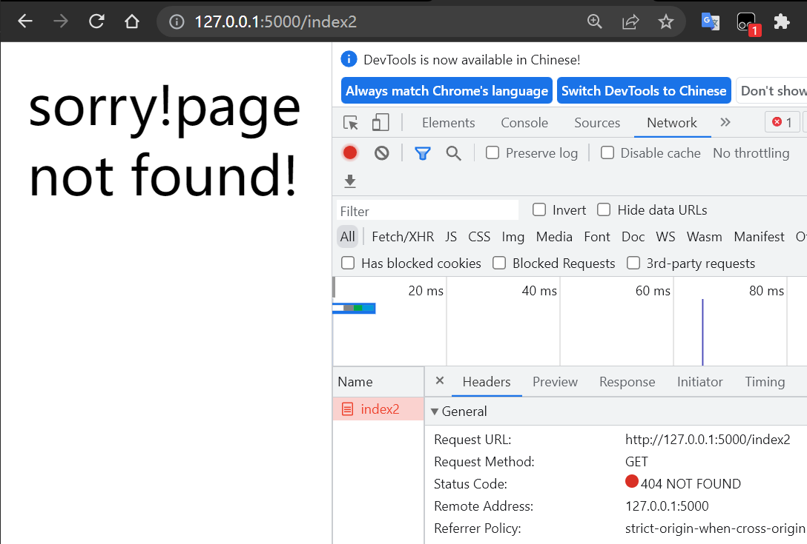

**可以自定义返回值**

```bash
from flask import Flask, make_response

app = Flask(__name__)

@app.route('/index2')
def index2():
    return 'sorry!page not found!', 404

@app.route('/index4')
def index4():
    content = '''
    <!DOCTYPE html>
<html lang="en">
<head>
    <meta charset="UTF-8">
    <title>首页</title>
    <style>
        div {
            width: 100%;
            height: 100px;
            border: 2px solid red;
        }
    </style>
</head>
<body>
<h1>欢迎来到测试购物网站</h1>
<div>
    <ul>
        <li>hello</li>
        <li>abc</li>
        <li>world</li>
    </ul>
</div>
</body>
</html>
    '''
    reponse = make_response(content)  #返回值就是一个response对象
    reponse.headers['mytest'] = '123abc'
    return reponse

if __name__ == '__main__':
    app.run()
```

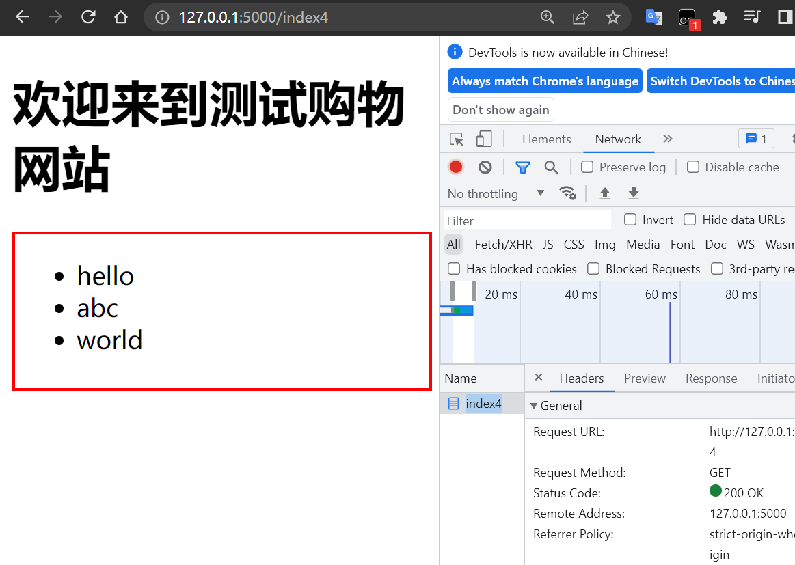

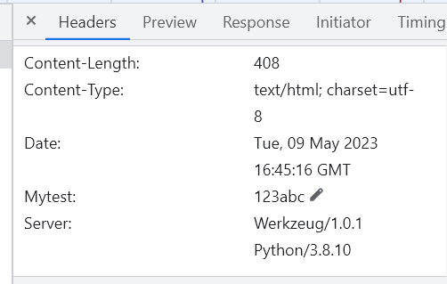


返回值: 
response响应对象

### request对象
参数:
```py
@app.route('/register')
def register():
    r = render_template('register.html')
    print(r)
    return r
```

模板:
需要把模板放到templates目录下
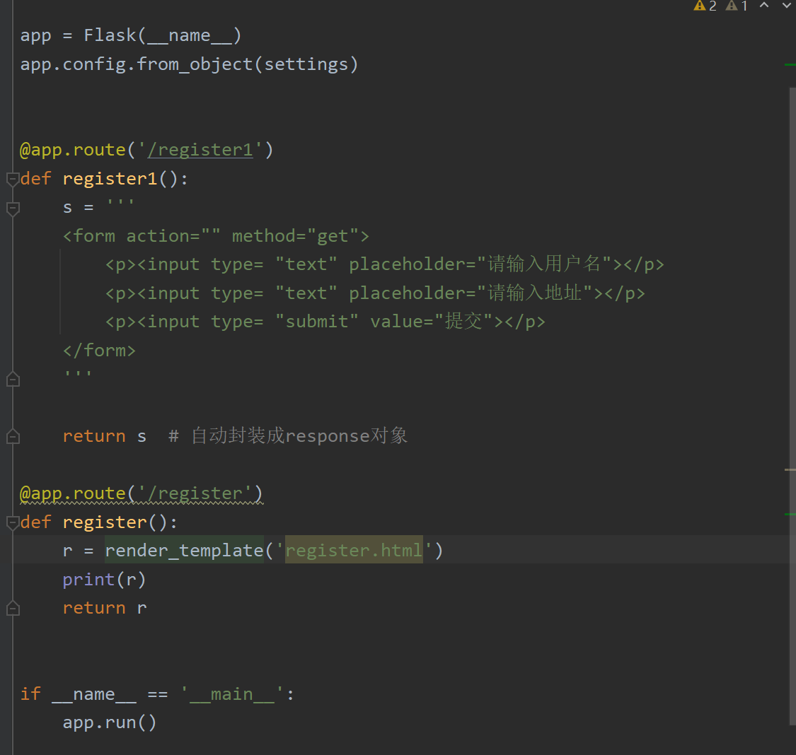

### 重定向和url

```py
@app.route('/register', methods=['GET','POST'])
def register():
    print(request.method)
    if request.method == 'POST':
        username = request.form.get('username')
        password = request.form.get('password')
        repassword = request.form.get('repassword')
        #用户密码一致性验证
        if password == repassword:
             #保存用户
            user = {'username': username, 'password' : password}
            users.append(user)
            return redirect('/')
         else:
             return '两次密码不一致'
         
    return render_template('register.html')
```

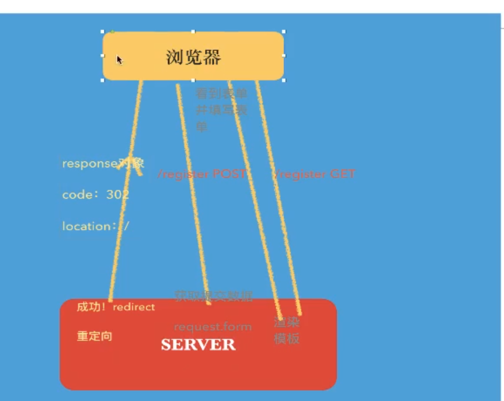


视图函数的返回值：
response响应： 
1. str 自动转成response对象 
2. dict json 
3. response对象 response对象 
4. make_response() response对象 
5. redirect() 重定向 302状态码 
6. render_template()| 模板渲染 ＋ 模板 

### 模板

[模板介绍(jinja2)](https://docs.jinkan.org/docs/flask/templating.html?highlight=%E6%A8%A1%E6%9D%BF)

模板：(网页)
模板的语法：
1. 在模板重获取view中传递的变量值: {{ 变量名key }}

render_template('模板名字',key=value,key=value)

    name = 'python' #字符串
    age = 18  #整型
    friends = ['a','b','c'] #列表
    dict1 = {'a':1,'b':2,'c':3} #字典
    #创建对象
    girlfrind = GirlFriend('小红','河南郑州') #自定义类构造的类型，Girl对象

模板:
    {{ list.0 }} 同 {{ list[0] }}
    {{ dict.key }} 同 {{ dict.get(key) }}
    {{ girl.name }} 同 {{ 对象.属性 }}

2. 控制块:
 
 
 
 

 
 

 
 

 



```py
<ul>

    <li>{{gir}}</i>

</ul>
```

可以使用Loop变量
Loop.index 序号从1开始 
Loop.index0 序号从0开始 
Loop.revindex reverse 序号是倒着的 
Loop.revindex0
loop.first 布尔类型 是否是第一行 
Loop.Last 布尔类型 是否是第二行 

3.过滤器
过滤器的本质就是函数
模板语法中过滤器：
{{变量名 ｜ 过滤器(＊args)}}{{变量名 ｜ 过滤器}}

常见的过滤器：
1. safe:
禁用转译 
```html
msg ＝<h1>520快乐！</h1>
return render_template('show_2.html', girls=girls,users=users, msg=msg) 
```
不想让其转译：
{{ msg | safe }}
2. capitalize：单词的首字母大写 {{ n1 | capitalize }}

3. Lower和upper 
大小写的转换
4. title: 每个单词的首字母大写
 msg = 'hello world'
 {{ msg | title }}
5. reverse: 字符串反转
 msg = 'hello world'
 {{ msg | reverse }}
6. format 
格式化字符串
 msg = 'hello {0} {1}'
 {{ msg | format('python','520') }}
7. truncate: 字符串截取
 msg = 'hello world'
 {{ msg | truncate(5) }}

list的操作
list的操作：
{#列表过滤器的使用#}
{{ girls | first }}<br> 
{{ girls | Last}}<br> 
{{ girls | length }}<br>
{#{{girls | sum}}# 整型的计算}
 {{ [1,3,5,7,9] | sum }-}<br> 
 {{ [1,8,5,7,3] | sort }}<br> 

dict：
 ---->获取值 
<p>{{ v }}</p>


<hr>
 ---->获取键 
<p>{{ k }}</p>


<hr>
｛% for k，v in users．0．items（）%｝ --->获取键值 <p>-{{ k }}---{{ v }}</p>
 


### 复习和自定义过滤器

request
request.method ----> app.url_map request.args
request.form 


response
1. 字符串 
2. 字典 
3. tuple 
4. response对象 
5. make_response() 
6. render_template() 
7. redirect() ---> response 重定向 
render＿template（＇模板名字＇，＊＊context）
render＿template（＇模板名字＇，name＝nameage＝age，...） 

模板语法：
1. 变量 
{{ name }} 
{{ age }} 
字符串 
列表 
tuple 
set
对象----＞［s1，s2，s3］
----->[{},{},{}]

2. 过滤器：本质就是函数
    通过flask模块中的add＿template＿filter方法
        a. 定义函数，带有参数和返回值
        b. 添加过滤器 app.add_template_filter(function1,name='') 
        c. 在模板中使用过滤器 {{ 变量名 | 过滤器名 }}
    使用装饰器完成
        a. 定义函数，带有参数和返回值
        b. 通过装饰器完成，@app.template_filter（'过滤器名字'）装饰步骤一的函数
        c. 在模板中使用： {{f 变量 | 自定义过滤器 }}

**模板：复用(举例：购物网站多个页面上下框架一样，只有中间内容不一样)**
模板继承 *
include

### flask模板继承和inlcude


