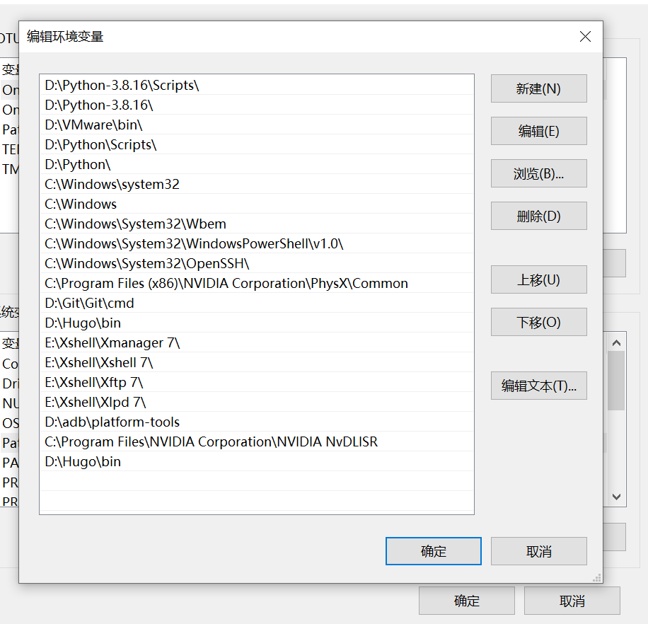
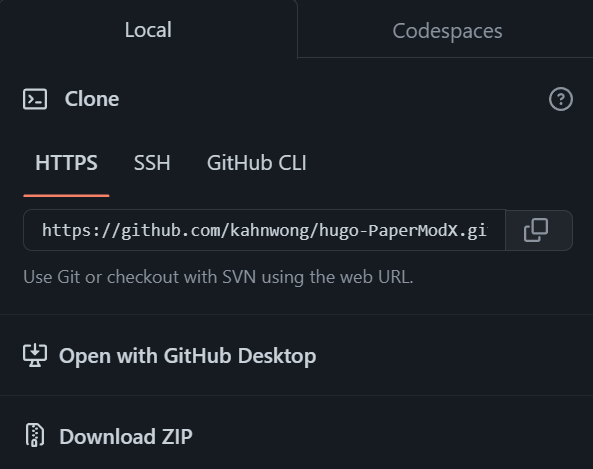
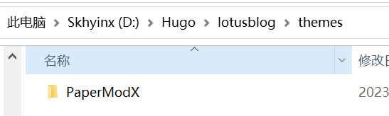
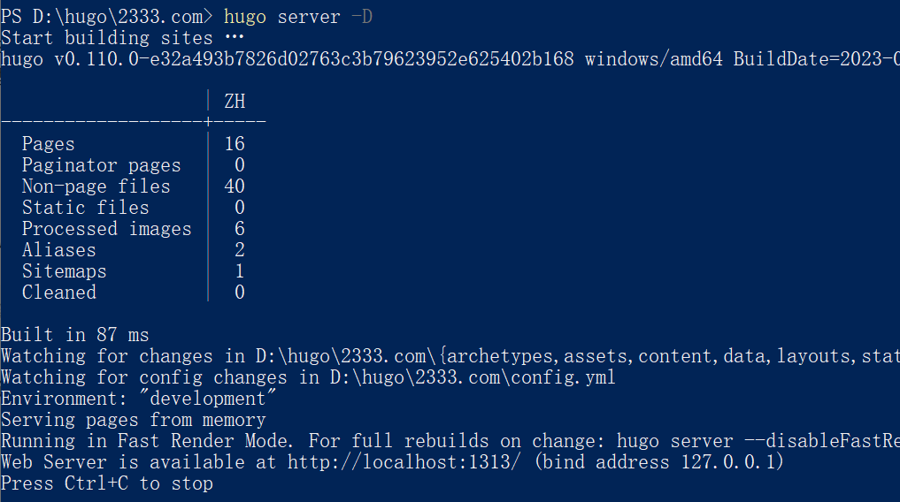
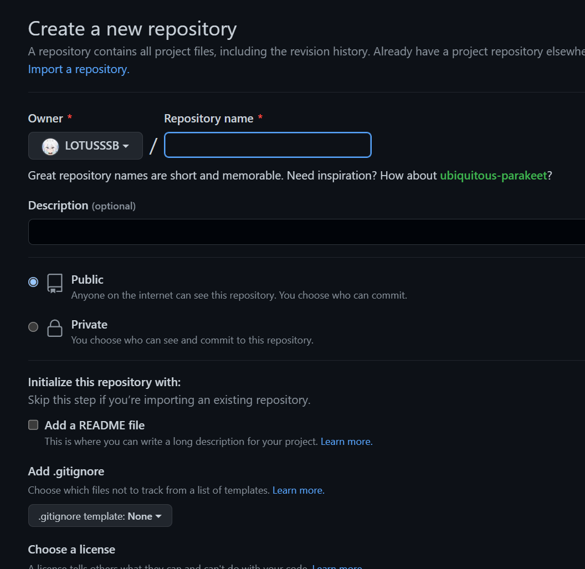
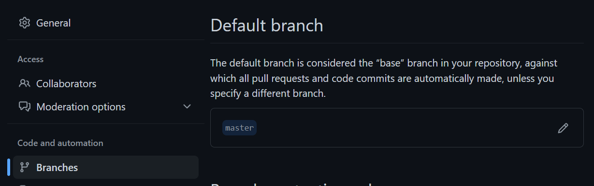

在跟随网上的教程搭建中，我发现了许多的问题，所以决定自己写一篇搭建教程

我会把自己遇到的问题详细的列出来，并给予解决方案

## 第一步，安装Hugo

1.浏览官方的[使用指南](https://gohugo.io/installation/)

本次部署使用的是Windows系统

如果你对操作有些困惑，这份[指南](https://gohugo.io/installation/)有对其他系统如何安装Hugo的详细说明

在这里我选择了使用对新手比较友好的方式，从[GitHub主页](https://github.com/gohugoio/hugo)下载zip包下载后添加到环境变量

找到并点击**Releases**选择适合自己的安装包


Windows系统选择带有**Windows**字样的安装包


下载后解压到适合的文件夹,找到**bin文件**，**复制路径到环境变量中**


至此，Hugo就安装完毕了！

## 第二步，新建一个Hugo网站

1.进入你想存放Hugo网站文件的文件夹，**在文件夹下**使用终端(cmd)执行以下命令新建一个Hugo网站

```bash
hugo new site myblog  # "myblog" 是我的网站文件夹名
```

2.选择Hugo主题并克隆至本地目录

打开 [Hugo Themes](https://themes.gohugo.io/) 页面，选择一个你喜欢的主题

我选择的是[PaperModX](https://github.com/kahnwong/hugo-PaperModX)主题

**进入themes文件夹**

将所选主题克隆到本地(themes文件夹下)


点击复制按钮，执行

```bash
git clone 复制得到的链接
```

**clone成功后，还需要修改文件夹名为你的主题名才可正常运转**，在这里我修改文件名为PaperModX


3.编辑配置文件

编辑文件是Hugo自定义的灵魂所在，值得各位研究,官方提供了[英文文档](https://adityatelange.github.io/hugo-PaperMod/),更有第三方的[中文文档](https://note.ftls.xyz/papermod/),也可以仿照他人的[范例](https://adityatelange.github.io/hugo-PaperMod/)进行修改，

4.新建一篇文章

- 进入网站文件夹的根目录

  使用以下命令新建一篇文章

  ```bash
  hugo new post/my-first-post.md # "my-first-post.md"是新建文章的文件名
  ```
  
- 这里我采用另一种方法，来自这位[大佬的博客](https://wrong.wang/blog/20190301-%E6%9C%AC%E7%AB%99%E5%BC%95%E7%94%A8%E5%9B%BE%E7%89%87%E7%9A%84%E9%A1%BA%E6%BB%91%E6%B5%81%E7%A8%8B/)

  思路是**每一篇文章都创建一个新的文件夹**，将所需要的**图片放在文件夹下**

  而不用使用Hugo传统的把图片放在其他文件夹，方便了引用

  **注意：文件夹下的文章需命名为index.md，否则无法识别**

5.编辑新建的文章，添加内容并保存

6.本地预览网页效果

启动Hugo server

```bash
hugo server -D
```


使用浏览器打开 http://localhost:1313 预览

- 如果你对预览效果满意，进入下一步。
- 如果不满意，编辑 `config.toml` 配置文件，再次预览。


在对你的网站满意后，可以进行上传到Github Pages了

## 第三步，上传到Github Pasges

1.新建一个Github库

打开 GitHub Pages 官网，浏览并了解 User or organization site 部分对应的操作步骤。

GitHub Pages: [https://pages.github.com](https://link.zhihu.com/?target=https%3A//pages.github.com/)

新建一个 GitHub repository，库名为 *username*.[http://github.io](https://link.zhihu.com/?target=http%3A//github.io)，

username 即你的 GitHub 账号 username。新建 repository：[https://github.com/new](https://link.zhihu.com/?target=https%3A//github.com/new)

**例如**，**在我的Repository name处就填入LOTUSSSB.github.io**




**注意：创建后需要更改Branch的路径，否则可能无法上传！**

在仓库的设置中找到**Branches**一栏，并**改Defaul branch为master**



2.在Hugo的网站根目录下，执行hugo命令来构建上传到GitHub的静态页面

```bash
hugo  # 构建你的 Hugo 网站，默认将静态站点保存到 "public" 目录。
```

3.进入public文件夹，初始化git库
```bash
git init  # 初始化 Git 库
```


4.将 Git 本地库关联至远程库

在public目录下，为Git 本地库添加远程库
```bash
git remote add origin git@github.com:LOTUSSSB/LOTUSSSB.github.io.git  # "LOTUSSSB/LOTUSSSB.github.io.git" 代表 "your-github-id/your-github-id.github.io.git"。
```

查看 config 文件
```bash
cat .git/config  # 显示 config 信息。
```

上述命令结果返回如下：
```bash
[core]
    repositoryformatversion = 0
    filemode = true
    bare = false
    logallrefupdates = true
    ignorecase = true
    precomposeunicode = true
[remote "origin"]
    url = git@github.com:LOTUSSSB/LOTUSSSB.github.io.git
    fetch = +refs/heads/*:refs/remotes/origin/*
```
如果 [remote "origin"] 信息正常显示，说明你的 Git 本地库已成功关联至远程库

5.提交你的修改至本地库

在public文件下，通过commit提交修改,并写一个 commit message 来简洁描述你的修改

```bash
git status  # 查看当前修改状态。
git add .  # 添加所有修改过的文件。你也可以只添加某个文件。
git commit -m "Add a new post"  # "Add a new post" 是 commit message.
```

6.将你的修改推至远程库
在public文件下，将修改推至远程库
```bash
git push -u origin master
```
查看你的Github仓库是否已经上传成功，若成功

**恭喜！现在你已经走完了全程，拥有了一个自己构建的博客网站!**

访问 https://你的用户名.github.io 来访问吧！

## 后续文章更新
Hugo更新文章的方法比较麻烦，需要重新在网站根目录执行
```bash
hugo new post/你想要的文章名字.md
```
如果你采用的是上面建议的文章和图片放一起的方式，则需要执行
```bash
hugo new post/index.md
```
并且**重新手动创建一个文件夹**来存放新的文章

添加文章完成后，需要重新构建站点，在网站根目录下执行
```bash
hugo -D
```
这样就能重新构建新的文件到public文件了

完成后执行
```bash
git status  # 查看当前修改状态。
git add .  # 添加所有修改过的文件。你也可以只添加某个文件。
git commit -m "Add a new  new post"  # "Add a new new post" 
```
提交到本地

再通过push上传即可
```bash
git push -u origin master
````