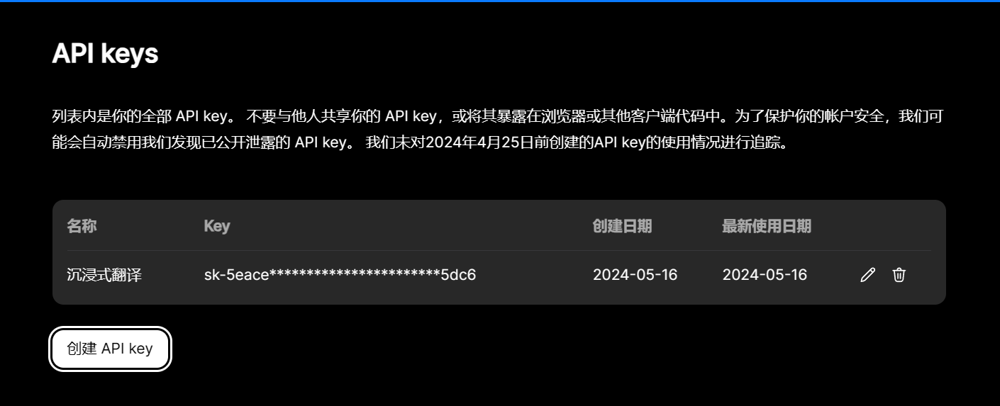
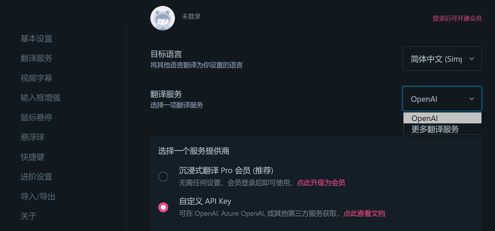
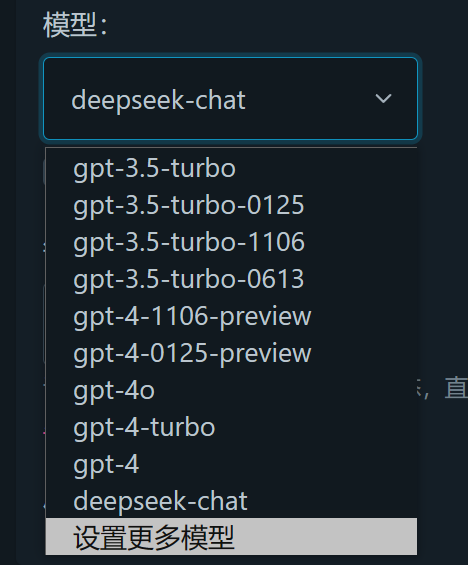
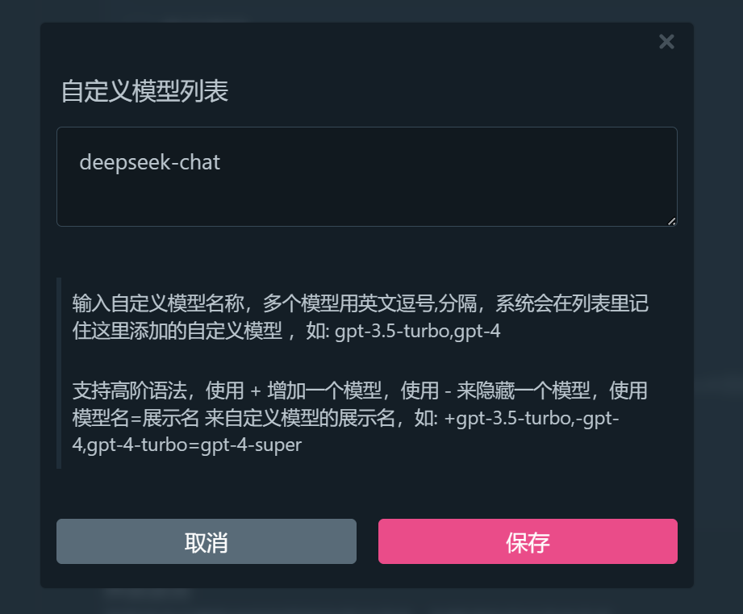
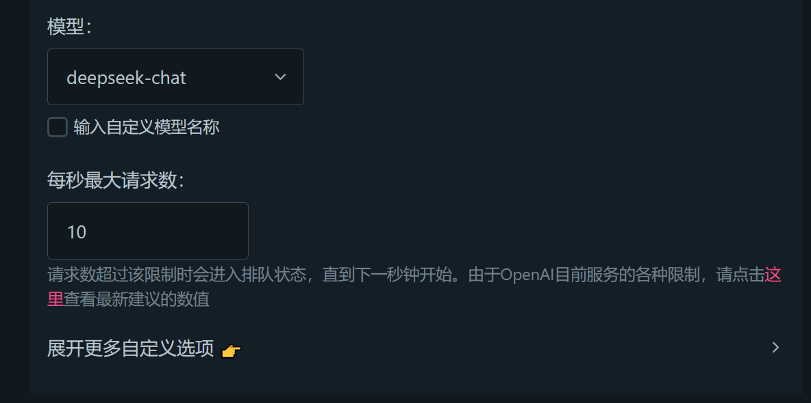
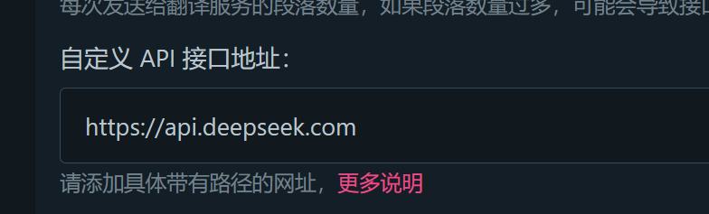

最近发现有个新的LLM号称自己强无敌，各种参数屌打其他国内ai，于是就去试了下，发现虽然效果没有吹嘘的那么好，但是API价格足够的便宜，索性决定用来做沉浸式翻译的API调用

1. 首先，你需要注册一个[deepseek](https://platform.deepseek.com/)平台的账户

2. 点击创建API KEY后，复制好这个API KEY

3. 

回到沉浸式翻译

在设置找到翻译服务，点击OpenAI

点击自定义API

API KEY就填写你刚刚复制好的API KEY

在模型这里，找到设置更多模型

输入deepseek-chat

点击下方的展开更多选项

找到自定义API地址，输入 https://api.deepseek.com 就大功告成啦！

4. **现在，享受便宜且优秀的翻译服务吧！**