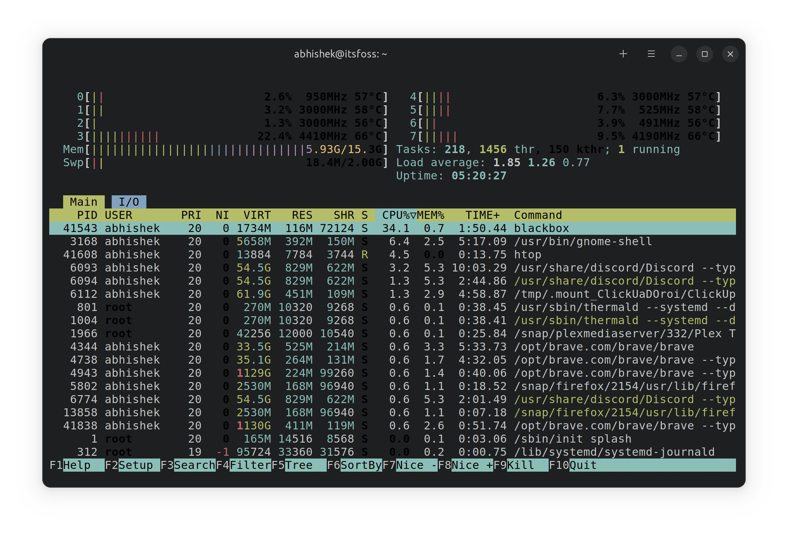

# Linux课程

## 1.1初识Linux

具有商业能力的并且免费的Linux是**Centos**

各种认证：

RHCE红帽认证


Linux系统部署--获取linux常用发行版的方法

为了方便传输，压制成ISO文件


## **1.2文件管理**

Linux目录结构视图


系统目录（文件夹）

**Bin:**binary**二进制**

**Boot：**启动相关的文件

**Dev：**device设备

**Etc：**配置文件（控制台文件

**Home：**装用户自己的文件

**Run：**运行目录

**Sbin:**temp

**Usr:**应用程序


Linux 命令语法

1. cd
2. ls
3. pwd
4. 

**命令   选项   参数**

ls        -l         /(默认显示根目录的内容)


### 文件管理命令

ls -l

1. 改变命令

   ------------------------

   cd 绝对路径或相对路径

   cd 绝对路径 cd /home/alice

   cd 相对路径 cd . ..

   --------------------------------------------------

   

2. .创建文件

   -----------------------

   ls 列出目录当中的内容

   举例说明

   ls /

   ```bash
   -a, --all     不隐藏任何以. 开始的项目
   -A, --almost-all    列出除. 及.. 以外的任何项目
       --author      与-l 同时使用时列出每个文件的作者
   -b, --escape      以八进制溢出序列表示不可打印的字符
       --block-size=SIZE      scale sizes by SIZE before printing them; e.g.,
                                '--block-size=M' prints sizes in units of
                                1,048,576 bytes; see SIZE format below
   -B, --ignore-backups       do not list implied entries ending with ~
   -c                         with -lt: sort by, and show, ctime (time of last
                                modification of file status information);
                                with -l: show ctime and sort by name;
                                otherwise: sort by ctime, newest first
   -C                         list entries by columns
       --color[=WHEN]         colorize the output; WHEN can be 'never', 'auto',
                                or 'always' (the default); more info below
   -d, --directory            list directories themselves, not their contents
   -D, --dired                generate output designed for Emacs' dired mode
   -f                         do not sort, enable -aU, disable -ls --color
   -F, --classify             append indicator (one of */=>@|) to entries
       --file-type            likewise, except do not append '*'
       --format=WORD          across -x, commas -m, horizontal -x, long -l,
                                single-column -1, verbose -l, vertical -C
       --full-time            like -l --time-style=full-iso
   -g        类似-l，但不列出所有者
       --group-directories-first
                              group directories before files;
                                can be augmented with a --sort option, but any
                                use of --sort=none (-U) disables grouping
   -G, --no-group    以一个长列表的形式，不输出组名
   -h, --human-readable    与-l 一起，以易于阅读的格式输出文件大小
         (例如 1K 234M 2G)
       --si      同上面类似，但是使用1000 为基底而非1024
   -H, --dereference-command-line
                              follow symbolic links listed on the command line
       --dereference-command-line-symlink-to-dir
                              follow each command line symbolic link
                                that points to a directory
       --hide=PATTERN         do not list implied entries matching shell PATTERN
                                (overridden by -a or -A)
       --indicator-style=WORD  append indicator with style WORD to entry names:
                                none (default), slash (-p),
                                file-type (--file-type), classify (-F)
   -i, --inode                print the index number of each file
   -I, --ignore=PATTERN       do not list implied entries matching shell PATTERN
   -k, --kibibytes            default to 1024-byte blocks for disk usage
   -l        使用较长格式列出信息
   -L, --dereference   当显示符号链接的文件信息时，显示符号链接所指示
         的对象而并非符号链接本身的信息
   -m        所有项目以逗号分隔，并填满整行行宽
   -n, --numeric-uid-gid   类似 -l，但列出UID 及GID 号
   -N, --literal     输出未经处理的项目名称 (如不特别处理控制字符)
   -o        类似 -l，但不列出有关组的信息
   -p,  --indicator-style=slash  对目录加上表示符号"/"
   -q, --hide-control-chars   print ? instead of nongraphic characters
       --show-control-chars   show nongraphic characters as-is (the default,
                                unless program is 'ls' and output is a terminal)
   -Q, --quote-name           enclose entry names in double quotes
       --quoting-style=WORD   use quoting style WORD for entry names:
                                literal, locale, shell, shell-always, c, escape
   -r, --reverse     逆序排列
   -R, --recursive   递归显示子目录
   -s, --size      以块数形式显示每个文件分配的尺寸
   -S                         sort by file size
       --sort=WORD            sort by WORD instead of name: none (-U), size (-S),
                                time (-t), version (-v), extension (-X)
       --time=WORD            with -l, show time as WORD instead of default
                                modification time: atime or access or use (-u)
                                ctime or status (-c); also use specified time
                                as sort key if --sort=time
       --time-style=STYLE     with -l, show times using style STYLE:
                                full-iso, long-iso, iso, locale, or +FORMAT;
                                FORMAT is interpreted like in 'date'; if FORMAT
                                is FORMAT1<newline>FORMAT2, then FORMAT1 applies
                                to non-recent files and FORMAT2 to recent files;
                                if STYLE is prefixed with 'posix-', STYLE
                                takes effect only outside the POSIX locale
   -t                         sort by modification time, newest first
   -T, --tabsize=COLS         assume tab stops at each COLS instead of 8
   -u                         with -lt: sort by, and show, access time;
                                with -l: show access time and sort by name;
                                otherwise: sort by access time
   -U                         do not sort; list entries in directory order
   -v                         natural sort of (version) numbers within text
   -w, --width=COLS           assume screen width instead of current value
   -x                         list entries by lines instead of by columns
   -X                         sort alphabetically by entry extension
   -1                         list one file per line
   
   SELinux options:
   
   --lcontext                 Display security context.   Enable -l. Lines
                              will probably be too wide for most displays.
   -Z, --context              Display security context so it fits on most
                              displays.  Displays only mode, user, group,
                              security context and file name.
   --scontext                 Display only security context and file name.
       --help    显示此帮助信息并退出
       --version   显示版本信息并退出
   ```

   touch 路径和名字

   例如#touch /aaa/bbb/ccc **是在ccc/aaa/bbb/ccc目录创建**

   #touch /fire.txt

   ```bash
   -a：或--time=atime或--time=access或--time=use  只更改存取时间；
   -c：或--no-create  不建立任何文件；
   -d：<时间日期> 使用指定的日期时间，而非现在的时间；
   -f：此参数将忽略不予处理，仅负责解决BSD版本touch指令的兼容性问题；
   -m：或--time=mtime或--time=modify  只更该变动时间；
   -r：<参考文件或目录>  把指定文件或目录的日期时间，统统设成和参考文件或目录的日期时间相同；
   -t：<日期时间>  使用指定的日期时间，而非现在的时间；
   --help：在线帮助；
   --version：显示版本信息。
   ```

   -------------

   

3. 创建目录

   mkdir /aaa/bbb/c1

   mkdir -p

   ```bash
   -Z：设置安全上下文，当使用SELinux时有效；
   -m<目标属性>或--mode<目标属性>建立目录的同时设置目录的权限；
   -p或--parents 若所要建立目录的上层目录目前尚未建立，则会一并建立上层目录；
   --version 显示版本信息。
   ```

4. 复制

   cp 源文件路径 目标文件夹

   ```bash
   -a：此参数的效果和同时指定"-dpR"参数相同；
   -d：当复制符号连接时，把目标文件或目录也建立为符号连接，并指向与源文件或目录连接的原始文件或目录；
   -f：强行复制文件或目录，不论目标文件或目录是否已存在；
   -i：覆盖既有文件之前先询问用户；
   -l：对源文件建立硬连接，而非复制文件；
   -p：保留源文件或目录的属性；
   -R/r：递归处理，将指定目录下的所有文件与子目录一并处理；
   -s：对源文件建立符号连接，而非复制文件；
   -u：使用这项参数后只会在源文件的更改时间较目标文件更新时或是名称相互对应的目标文件并不存在时，才复制文件；
   -S：在备份文件时，用指定的后缀“SUFFIX”代替文件的默认后缀；
   -b：覆盖已存在的文件目标前将目标文件备份；
   -v：详细显示命令执行的操作。
   ```

5. 移动

   mv 源文件路径 目标文件路径

   ```bash
   --backup=<备份模式>：若需覆盖文件，则覆盖前先行备份；
   -b：当文件存在时，覆盖前，为其创建一个备份；
   -f：若目标文件或目录与现有的文件或目录重复，则直接覆盖现有的文件或目录；
   -i：交互式操作，覆盖前先行询问用户，如果源文件与目标文件或目标目录中的文件同名，则询问用户是否覆盖目标文件。用户输入”y”，表示将覆盖目标文件；输入”n”，表示取消对源文件的移动。这样可以避免误将文件覆盖。
   --strip-trailing-slashes：删除源文件中的斜杠“/”；
   -S<后缀>：为备份文件指定后缀，而不使用默认的后缀；
   --target-directory=<目录>：指定源文件要移动到目标目录；
   -u：当源文件比目标文件新或者目标文件不存在时，才执行移动操作
   ```

6. 删除

   rm -rf

   ```bash
   -d：直接把欲删除的目录的硬连接数据删除成0，删除该目录；
   -f：强制删除文件或目录；
   -i：删除已有文件或目录之前先询问用户；
   -r或-R：递归处理，将指定目录下的所有文件与子目录一并处理；
   --preserve-root：不对根目录进行递归操作；
   -v：显示指令的详细执行过程。
   ```

7. 查看文件内容

   **cat全部**（直接翻到尾部

   ```bash
   -n或--number：从1开始对所有输出的行数编号；
   -b或--number-nonblank：和-n相似，只不过对于空白行不编号；
   -s或--squeeze-blank：当遇到有连续两行以上的空白行，就代换为一行的空白行；
   -A：显示不可打印字符，行尾显示“$”；
   -e：等价于"-vE"选项；
   -t：等价于"-vT"选项；
   ```

   more翻页

   head头部（开头几行

   ```bash
   -n<数字>：指定显示头部内容的行数；
   -c<字符数>：指定显示头部内容的字符数；
   -v：总是显示文件名的头信息；
   -q：不显示文件名的头信息。
   ```

   tail尾部

   **grep过滤关键词**

   ```bash
   -a --text  # 不要忽略二进制数据。
   -A <显示行数>   --after-context=<显示行数>   # 除了显示符合范本样式的那一行之外，并显示该行之后的内容。
   -b --byte-offset                           # 在显示符合范本样式的那一行之外，并显示该行之前的内容。
   -B<显示行数>   --before-context=<显示行数>   # 除了显示符合样式的那一行之外，并显示该行之前的内容。
   -c --count    # 计算符合范本样式的列数。
   -C<显示行数> --context=<显示行数>或-<显示行数> # 除了显示符合范本样式的那一列之外，并显示该列之前后的内容。
   -d<进行动作> --directories=<动作>  # 当指定要查找的是目录而非文件时，必须使用这项参数，否则grep命令将回报信息并停止动作。
   -e<范本样式> --regexp=<范本样式>   # 指定字符串作为查找文件内容的范本样式。
   -E --extended-regexp             # 将范本样式为延伸的普通表示法来使用，意味着使用能使用扩展正则表达式。
   -f<范本文件> --file=<规则文件>     # 指定范本文件，其内容有一个或多个范本样式，让grep查找符合范本条件的文件内容，格式为每一列的范本样式。
   -F --fixed-regexp   # 将范本样式视为固定字符串的列表。
   -G --basic-regexp   # 将范本样式视为普通的表示法来使用。
   -h --no-filename    # 在显示符合范本样式的那一列之前，不标示该列所属的文件名称。
   -H --with-filename  # 在显示符合范本样式的那一列之前，标示该列的文件名称。
   -i --ignore-case    # 忽略字符大小写的差别。
   -l --file-with-matches   # 列出文件内容符合指定的范本样式的文件名称。
   -L --files-without-match # 列出文件内容不符合指定的范本样式的文件名称。
   -n --line-number         # 在显示符合范本样式的那一列之前，标示出该列的编号。
   -q --quiet或--silent     # 不显示任何信息。
   -R/-r  --recursive       # 此参数的效果和指定“-d recurse”参数相同。
   -s --no-messages  # 不显示错误信息。
   -v --revert-match # 反转查找。
   -V --version      # 显示版本信息。   
   -w --word-regexp  # 只显示全字符合的列。
   -x --line-regexp  # 只显示全列符合的列。
   -y # 此参数效果跟“-i”相同。
   -o # 只输出文件中匹配到的部分。
   ```

8. **修改文件内容**

   - 重定向

     **ls -a > list.txt**   **>为重定向**（将屏幕输出的内容写进文件里

     例：

     `[root@iZj6c1zu4raeku70qjuv29Z ~]# cat /etc/hosts`
     `::1	localhost	localhost.localdomain	localhost6	localhost6.localdomain6`
     `127.0.0.1	localhost	localhost.localdomain	localhost4	localhost4.localdomain4`

     `192.168.0.152	iZbp12eonmsr3vv8d7bwgxZ	iZbp12eonmsr3vv8d7bwgxZ`

     `172.19.10.237	iZj6c1zu4raeku70qjuv29Z	iZj6c1zu4raeku70qjuv29Z`

     `[root@iZj6c1zu4raeku70qjuv29Z ~]# cat /1.txt`
     `::1	localhost	localhost.localdomain	localhost6	localhost6.localdomain6`
     `127.0.0.1	localhost	localhost.localdomain	localhost4	localhost4.localdomain4`

     `192.168.0.152	iZbp12eonmsr3vv8d7bwgxZ	iZbp12eonmsr3vv8d7bwgxZ`

     `172.19.10.237	iZj6c1zu4raeku70qjuv29Z	iZj6c1zu4raeku70qjuv29Z`

   - 文件编辑器1

     gedit（ssh没有

     

   - 文件编辑器2

     - vi，vim

     - VI的三个模式

     - 命令模式

       - 光标定位（了解

         hjkl  //上下左右

         0 $   //行首行尾

         gg G   //页首页尾

         3G 进入第三行

     - 拓展命令模式

       1. 保存退出

          **：w保存**

          **:q 退出**

          **:wq 保存并退出**

       2. 查找替换

          :范围 **s/原内容/新内容/全局**

          :1,5 s/root/lotus/g   从1-5行的root替换为lotus

       3. 读入文件/写文件（另存为

          :w /tmp/aaa.txt **另存为/tmp/aaa.txt**

       4. 设置环境

          :set nu 设置行号

          :set list 显示控制字符

          :set nonu 取消设置行号

          

vim未正常关闭，产生的临时文件，解决方法

​		vim /1.txt 原来的还在

​					/.1.txt.swp意外之前也在

### 什么是相对路径？什么是绝对路径？

#### 相对路径

​	两种表达式：

​	当前目录 .

​	上一级目录..

rm -rf ./file2

cp ./file3 /home

mv ./fire4 /tmp

#### 绝对路径

​	从根开始描述

​	距离：/home/abc/1.txt

​	定位文件

​	能找到所有文件 

​	

`实例：`

`[root@LOTUS ~]# mkdir -pv /home/{lotus/{dir1,111},nizhan}`
`mkdir: created directory ‘/home/lotus’`
`mkdir: created directory ‘/home/lotus/dir1’`
`mkdir: created directory ‘/home/lotus/111’`
`mkdir: created directory ‘/home/nizhan’`

用户组信息储存的文件

1.用户基本信息文件

​	/etc/passwd(冒号分分割位7列字段)

`root:x:0:0:root:/root:/bin/bash`

`用户名:x:uid:gid:描述:HOME:shell`

​			uid:0 特权用户

​			uid:1~499 系统用户

​			uid:1000+ 普通用户

​			用户名：登陆系统的名字

​			x：密码占位符

2.用户密码信息文件

3.组信息文件


## 1.3用户的权限

**chmod命令**

`u User，即文件或目录的拥有者；`
`g Group，即文件或目录的所属群组；`
`o Other，除了文件或目录拥有者或所属群组之外，其他用户皆属于这个范围；`
`a All，即全部的用户，包含拥有者，所属群组以及其他用户；`
`r 读取权限，数字代号为“4”;`
`w 写入权限，数字代号为“2”；`
`x 执行或切换权限，数字代号为“1”；`
`- 不具任何权限，数字代号为“0”；`
`s 特殊功能说明：变更文件或目录的权限。`


```bash
u  # 操作对象简称，用户user，文件或目录的所有者。
g  # 操作对象简称，同组用户group，文件或目录所属群组
o  # 操作对象简称，其它用户others
a  # 操作对象简称，所有用户all，系统默认使用此项
+  # 权限操作符，添加某些权限
-  # 权限操作符，取消某些权限
=  # 权限操作符，设置文件的权限为给定的权限
r  # 权限设定（英文），表示可读权限
w  # 权限设定（英文），表示可写权限
x  # 权限设定（英文），表示可执行权限（x=excution
-  # 权限设定（英文字符），表示没有权限
X  # 权限设定，如果目标文件是可执行文件或目录，可给其设置可执行权限
s  # 权限设定，设置权限suid和sgid，使用权限组合“u+s”设定文件的用户的ID位，“g+s”设置组ID位
t  # 权限设定，只有目录或文件的所有者才可以删除目录下的文件
-c或——changes    # 效果类似“-v”参数，但仅回报更改的部分，如果文件权限已经改变，显示其操作信息；
-f或--quiet或——silent # 操作过程中不显示任何错误信息；
-R或——recursive  # 递归处理，将指令目录下的所有文件及子目录一并处理；
-v或——verbose    # 显示命令运行时的详细执行过程；
--reference=<参考文件或目录> # 把指定文件或目录的所属群组全部设成和参考文件或目录的所属群组相同；
<权限范围>+<权限设置> # 开启权限范围的文件或目录的该选项权限设置；
<权限范围>-<权限设置> # 关闭权限范围的文件或目录的该选项权限设置；
<权限范围>=<权限设置> # 指定权限范围的文件或目录的该选项权限设置；
--help    # 显示帮助信息
--version # 显示版本信息
```


**语法： chmod 对象(u/g/p/a)赋值符(+/-/=)权限类型(r/w/x)  文件/目录**

`[root@iZj6c1zu4raeku70qjuv29Z ~]# touch fire1.txt`
`[root@iZj6c1zu4raeku70qjuv29Z ~]# ls fire1.txt`
`fire1.txt`
`[root@iZj6c1zu4raeku70qjuv29Z ~]# ls -l fire1.txt`
`-rw-r--r-- 1 root root 0 Feb 11 00:07 fire1.txt`

**第一个root是用户**

**第二个是账户组**


**在这里所有用户只有读和可执行命令 **    **a=rx**


实例：

`[root@iZj6c1zu4raeku70qjuv29Z ~]# chmod u+x fire1.txt`

`[root@iZj6c1zu4raeku70qjuv29Z ~]# ls -l fire1.txt-rwxr--r-- 1 root root 0 Feb 11 00:07 fire1.txt`

`[root@iZj6c1zu4raeku70qjuv29Z ~]# vim fire1.txt` 

`#echo是输入指定的变量`
`read -p "input name:"   name`
`echo "haha $name dabendan"`

`[root@iZj6c1zu4raeku70qjuv29Z ~]# ./fire1.txt`
`help 2023`
`input name:dabend`
`haha dabend dabendan`


授权有三个数字可写

`[root@iZj6c1zu4raeku70qjuv29Z ~]# vim fire1.txt` 
`[root@iZj6c1zu4raeku70qjuv29Z ~]# chmod 777 fire1.txt`
`[root@iZj6c1zu4raeku70qjuv29Z ~]# ls -l fire1.txt` 
`-rwxrwxrwx 1 root root 73 Feb 11 00:21 fire1.txt`

**由以下而来： 7代表了1+2+4**

`r 读取权限，数字代号为“4”;`
`w 写入权限，数字代号为“2”；`
`x 执行或切换权限，数字代号为“1”；`
`- 不具任何权限，数字代号为“0”；`

**三位分表代表   用户   组   其他**

### chown命令（**chang own**

chown：设置一个文件属于谁，属主

**语法：  chown  用户名.组名  文件**

### chgrp 改组


查看文件有哪些ACL权限

`[root@iZj6c1zu4raeku70qjuv29Z ~]# getfacl fire1.txt` 

`file: fire1.txt`

`owner: root`

`group: root`

`user::rwx`
`group::rwx`
`other::rwx`


### watch命令

监听文件

`[root@iZj6c1zu4raeku70qjuv29Z ~]# watch -n0.5 'ls -l fire1.txt'`

```bash
-n # 或--interval  watch缺省每2秒运行一下程序，可以用-n或-interval来指定间隔的时间。
-d # 或--differences  用-d或--differences 选项watch 会高亮显示变化的区域。 而-d=cumulative选项会把变动过的地方(不管最近的那次有没有变动)都高亮显示出来。
-t # 或-no-title  会关闭watch命令在顶部的时间间隔,命令，当前时间的输出。
-h, --help # 查看帮助文档
```

```bash
watch -n 1 -d netstat -ant       # 命令：每隔一秒高亮显示网络链接数的变化情况
watch -n 1 -d 'pstree|grep http' # 每隔一秒高亮显示http链接数的变化情况。 后面接的命令若带有管道符，需要加''将命令区域归整。
watch 'netstat -an | grep:21 | \ grep<模拟攻击客户机的IP>| wc -l' # 实时查看模拟攻击客户机建立起来的连接数
watch -d 'ls -l|grep scf'       # 监测当前目录中 scf' 的文件的变化
watch -n 10 'cat /proc/loadavg' # 10秒一次输出系统的平均负载
watch uptime
watch -t uptime
watch -d -n 1 netstat -ntlp
watch -d 'ls -l | fgrep goface'     # 监测goface的文件
watch -t -differences=cumulative uptime
watch -n 60 from            # 监控mail
watch -n 1 "df -i;df"       # 监测磁盘inode和block数目变化情况
```

使用ls -l 命令监听（相当于ssh软件多开ssh

### chattr命令

用来改变文件属性

```bash
a：让文件或目录仅供附加用途；
b：不更新文件或目录的最后存取时间；
c：将文件或目录压缩后存放；
d：将文件或目录排除在倾倒操作之外；
i：不得任意更动文件或目录；
s：保密性删除文件或目录；
S：即时更新文件或目录；
u：预防意外删除。
```

加上属性之后文件就可以不被改动


**ACL权限：每一个文件只有一个所有者，只能有一个所有组，剩下都是others**


## 1.3进程管理

- 进程的状态

**ps aux**

R-run

T-stop

S-sleep

Z-zombie

### 动态查看进程top


PR NI 优先级

VIRT RES SHR内存

top常用内部指令

h|?帮助

M按内存的使用排序

P按CPU使用排序

N以PID的大小排序

<  向前        > 向后

z彩色，Z设置彩色

-9 强制退出

```bash
-a：当处理当前进程时，不限制命令名和进程号的对应关系；
-l <信息编号>：若不加<信息编号>选项，则-l参数会列出全部的信息名称；
-p：指定kill 命令只打印相关进程的进程号，而不发送任何信号；
-s <信息名称或编号>：指定要送出的信息；
-u：指定用户。
```

```bash
HUP     1    终端断线
INT     2    中断（同 Ctrl + C）
QUIT    3    退出（同 Ctrl + \）
TERM   15    终止
KILL    9    强制终止
CONT   18    继续（与STOP相反， fg/bg命令）
STOP   19    暂停（同 Ctrl + Z）
```

**使用信号控制进程**

**kill -9**

### 进程优先级nice


**nice在系统要20才能到系统级优先级**

**能调整的是-20到+19**


### 作业控制jobs（了解

查看后台进程


**消灭后台进程**

注意，“kill 1”       和       “kill %1”     不同

前者中止pid为1的进程

后者杀死作业序号为1的后台程序

## 1.4管道和重定向

FD简称

file descriptors文件描述符，文件句柄进程使用文件描述符来管理打开的文件


### 管道命令

**语法   command1 | command2 | command3|...**

**指令1输出信息到指令2到指令3**

[root@iZj6c1zu4raeku70qjuv29Z ~]# cat /etc/passwd | grep "root"
root:x:0:0:root:/root:/bin/bash
operator:x:11:0:operator:/root:/sbin/nologin


[root@iZj6c1zu4raeku70qjuv29Z ~]# cat /etc/passwd | grep "root"
root:x:0:0:root:/root:/bin/bash
operator:x:11:0:operator:/root:/sbin/nologin
[root@iZj6c1zu4raeku70qjuv29Z ~]# cat /etc/passwd | grep "root" | head -1
root:x:0:0:root:/root:/bin/bash
[root@iZj6c1zu4raeku70qjuv29Z ~]# cat /etc/passwd | head -1 |grep "root"
root:x:0:0:root:/root:/bin/bash

**使用|xargs成功链接rm命令**

[root@iZj6c1zu4raeku70qjuv29Z ~]# ls
1.txt  file2  file4  files.txt  mx        navidrome
file1  file3  file5  fire1.txt  mx-space


[root@iZj6c1zu4raeku70qjuv29Z ~]# cat files.txt |xargs rm -rvf
已删除"/root/file1"
已删除"/root/file2"
已删除"/root/file3"


**EOF：end of final**

## 1.5磁盘管理

**SATA（串口）**

**/dev/sda**

- /dev设备文件目录
- s代表sata就是串口
- d代表磁盘
- a第一块

**/dev/sdb**

**MRB和GPT分区表**

MBR支持最大的硬盘容量是<2TB，设计时分配四个分区

如果希望超过4个分区，需放弃主分区，改为扩展分区和逻辑分区。

GPT：全局唯一标识分区表(GUIDPartition Table,缩写：GPT)是一个实体硬盘的分区表的结构布局的标准，

GPT支持大于2T的硬盘，支持128个分区**（一般用MBR**

### 管理磁盘

添加磁盘

**管理磁盘三部曲**

分区MBR或者GPT-->格式化文件系统Filesystem-->挂载mount

**lsblk命令**


**名称  设备类型  序号  是否可移动设备  大小  是否只读磁盘或分区   挂载点**

#### 创建分区

启动分区工具

首先选择要进行操作的磁盘：**fdisk**

```bash
[root@localhost ~]# fdisk /dev/sdb
```

欢迎使用fdisk(util-linux2.23.2)。

更改将停留在内存中，直到您决定将更改写入磁盘。
使用写入命令前请三思。

Device does not contain a recognized partition table
使用磁盘标识符0xd43058cb创健新的DOS磁盘标签。

命令（输入m获取帮助）：n
Partition type:
p primary (0 primary,0 extended,4 free)
e extended
Select (default p):


输入`m`列出可以执行的命令：

```bash
command (m for help): m
Command action
   a   toggle a bootable flag
   b   edit bsd disklabel
   c   toggle the dos compatibility flag
   d   delete a partition
   l   list known partition types
   m   print this menu
   n   add a new partition
   o   create a new empty DOS partition table
   p   print the partition table
   q   quit without saving changes
   s   create a new empty Sun disklabel
   t   change a partition's system id
   u   change display/entry units
   v   verify the partition table
   w   write table to disk and exit
   x   extra functionality (experts only)
```

操作	     

敲击字母"p”键


起始扇区(2048-10485759，默认为2048)：
将使用默认值2048
Last扇区，+扇区or+size(K,M,G}(2048-10485759,默认为2048
操作

**输入分区大小“+2G”后回车**
**实际环境根据磁盘划分，如4T磁盘，可以50**

说明
选择磁盘分区结束的扇区，即分区大小


最后输入w（写

执行刚刚的操作

**刷新分区表**
**[root@localhost~]#partprobe /dev/sdb**

#### 创建文件系统

**[root@localhost~]#mkfs.ext4     /dev/sdb1**


新创建的分区，sdb2,5db3都要格式化

#### 挂载mount

**[root@localhost ~]mount  -t  ext4   /dev/sdb1   /mnt/disk1**

sdb1挂到disk1


**理解：给硬盘分好区之后，如果想要用他，就需要挂到某个文件夹下面，比如data文件夹**

比如d：盘分区之后能用是因为，d：自己分区


#### SWAP分区（交换分区

**推荐**
设置交换分区大小为内存的2倍

**生产**

大于4GB而小于16GB内存的系统，最小需要4GB交换空间：
生产
大于16GB而小于64GB内存的系统，最小需要8GB交换空间：
大于64GB而小于256GB内存的系统，最小需要16GB交换空间。

查看内存

free -m


```bash
-b # 以Byte为单位显示内存使用情况；
-k # 以KB为单位显示内存使用情况；
-m # 以MB为单位显示内存使用情况；
-g # 以GB为单位显示内存使用情况。 
-o # 不显示缓冲区调节列；
-s<间隔秒数> # 持续观察内存使用状况；
-t # 显示内存总和列；
-V # 显示版本信息。
```

```bash
free -t    # 以总和的形式显示内存的使用信息
free -s 10 # 周期性的查询内存使用信息，每10s 执行一次命令
```

```bash
total：内存总数；
used：已经使用的内存数；
free：空闲的内存数；
shared：当前已经废弃不用；
buffers Buffer：缓存内存数；
cached Page：缓存内存数。
```

准备将/dev/sde磁盘，划分为1G分区为例

增加分区

如果是增加 swap 分区，则先把当前所有分区**都关闭了**

```text
swapoff -a
```


划分分区后，将类型设置为82（按！！1老铁）
[root@server0~]#fdisk /dev/sde
1.准备分区

2.创建要作为 Swap 分区文件（其中 `/var/swapfile` 是文件位置，`bs*count` 是文件大下，例如以下命令就会创建一个 4G 的文件）：

```text
dd if=/dev/zero of=/var/swapfile bs=1M count=4096
```

.建立 Swap 的文件系统（格式化为 Swap 分区文件）：

```text
mkswap /var/swapfile
```

4.启用 Swap 分区：

```text
swapon /var/swapfile
```

5.查看 Linux 当前分区：

```text
free -m
```

如果有 Swap 就说明创建成功了：

6.设置开启启动，在 /etc/fstab 文件中加入一行代码：

```text
/var/swapfile swap swap defaults 0 0
```


**关于挂载**

未装载前，装载点内创建的文件不能再其装载到其他磁盘后看到。装载后，装载点内创建的文件也不可以在其卸载之后被看到。他们仅是存在于各自的磁盘上。


#### 逻辑卷LVM

物理磁盘的空间是限定的。不便于管理（拷贝，删除，授权）
单靠物理磁盘，是解决不了空间增长的问题的。

这种技术可以随意扩张磁盘

前言
目的：管理磁盘的一种方式，性质与基本磁盘无异
特点：随意扩张大小

在LVM中，其通过对底层的硬盘进行封装，当我们对底层的物理硬盘进行操作时，其不再是针对于分区进行操作，而是通过一个叫做逻辑卷的东西来对其进行底层的磁盘管理操作。比如说我增加一个物理硬盘，这个时候上层的服务是感觉不到的，因为呈现给上次服务的是以逻辑卷的方式。

术语
一、
创建LVM
二、VG管理
三、LV扩容

LVM实际操作
一、磁盘分区（物理分区）
1、首先把磁盘分成3个区，大小为1G：


2、分区好之后，输入：它，把分区类型更改为8e：


二、准备物理卷
在这之前，检查是否安装了lvm（pvcreat /dev/sdb1），如果未安装，安装命令：

**yum install -y lvm2**

1、安装好之后，创建物理卷：


2、查看物理卷：

**pvdisplay**

或

**pvs**


三、创建卷组
1、先用2个物理卷创建一个卷组vg1：

****

使用：vgdisplay或者vgs查看卷组信息


四、创建逻辑卷
1、在vg1卷组创建一个100M的逻辑卷：

**lvcreate -L 100M -n lv1 vg1**

## 补充说明

**lvcreate命令** 用于创建LVM的逻辑卷。逻辑卷是创建在卷组之上的。逻辑卷对应的设备文件保存在卷组目录下，例如：在卷组“vg1000”上创建一个逻辑卷“lvol0”，则此逻辑卷对应的设备文件为“/dev/vg1000/lvol0”。

2、查看逻辑卷信息：


3、逻辑卷格式化：


4、挂载逻辑卷：


5、逻辑卷扩容（增加100M）：

**umount /mnt/ //卸载磁盘**

**lvresize -L 200M /dev/vg1/lv1 //重新设置卷大小**

**e2fsck -f /dev/vg1/lv1 //检查磁盘错误（ext4）**

**resize2fs /dev/vg1/lv1 //更新逻辑卷信息**

**mount /mnt/ //重新挂载磁盘**


6、缩减逻辑卷大小（减少100M）：


、删除逻辑卷，卷组，物理卷：
我们在创建好逻辑卷后可以通过创建文件系统，挂载逻辑卷来使用它，如果说我们不想用了也可以将其删除掉。

**1、首先将正在使用的逻辑卷卸载掉　　通过 umount 命令**
**2、将逻辑卷先删除　　通过 lvremove 命令**
**3、删除卷组　　通过 vgremove 命令**
**4、最后再来删除我们的物理卷　　通过 pvremove 命令**

补充
1、xfs文件系统，增加文件大小之后，执行：

**xfs_growfs /dev/vg1/lv1**

2、在yum安装某个服务的时候，如果不知道这个服务的准确名称，但是知道其中的命令，比如LVM我们知道它的软件名称，但是知道LVM中的pvcreate命令，我们可以：

**yum provides “/*/pvcreate”**

安装好之后，无法创建物理卷，输入命令：

**partprobe**


#### 文件系统详解

1. 硬盘驱动

  常见的硬盘类型有PATA, SATA和AHCI等，在Linux系统中，对不同硬盘所提供的驱动模块一般都存放在内核目录树drivers/ata中，而对于一般通用的硬盘驱动，也许会直接被编译到内核中，而不会以模块的方式出现，可以通过查看/boot/config-xxx.xxx文件来确认：

  CONFIG_SATA_AHCI=y

    2. General Block Device Layer

  这一层的作用，正是解答了上面提出的第一个问题，不同的硬盘驱动，会提供不同的IO接口，内核认为这种杂乱的接口，不利于管理，需要把这些接口抽象一下，形成一个统一的对外接口，这样，不管你是什么硬盘，什么驱动，对外而言，它们所提供的IO接口没什么区别，都一视同仁的被看作块设备来处理。

  所以，如果在一层做的任何修改，将会直接影响到所有文件系统，不管是ext3,ext4还是其它文件系统，只要在这一层次做了某种修改，对它们都会产生影响。

    3. 文件系统

  文件系统这一层相信大家都再熟悉不过了，目前大多Linux发行版本默认使用的文件系统一般是ext4，另外，新一代的btrfs也呼之欲出，不管什么样的文件系统，都是由一系列的mkfs.xxx命令来创建，如：

  **mkfs.ext4 /dev/sda**

  **mkfs.btrfs /dev/sdb**

  内核所支持的文件系统类型，可以通过内核目录树 fs 目录中的内容来查看。

    4. 虚拟文件系统(VFS)

  Virtual File System这一层，正是用来解决上面提出的第二个问题，试想，当我们通过mkfs.xxx系列命令创建了很多不同的文件系统，但这些文件系统都有各自的API接口，而用户想要的是，不管你是什么API，他们只关心mount/umount，或open/close等操作。

  所以，VFS就把这些不同的文件系统做一个抽象，提供统一的API访问接口，这样，用户空间就不用关心不同文件系统中不一样的API了。VFS所提供的这些统一的API，再经过System Call包装一下，用户空间就可以经过SCI的系统调用来操作不同的文件系统。

  VFS所提供的常用API有：

  mount()， umount() …

  open()，close() …

  mkdir() …

二、Linux下的文件系统分类（以存储介质）
     和文件系统关系最密切的就是存储介质，存储介质大致有RAM，ROM，磁盘磁带，闪存等。

     闪存（Flash Memory）是一种长寿命的非易失性（在断电情况下仍能保持所存储的数据信息）的存储器，数据删除不是以单个的字节为单位而是以固定的区块为单位（注意：NOR Flash 为字节存储。），区块大小一般为256KB到20MB。闪存是电子可擦除只读存储器（EEPROM）的变种，EEPROM与闪存不同的是，它能在字节水平上进行删除和重写而不是整个芯片擦写，这样闪存就比EEPROM的更新速度快。由于其断电时仍能保存数据，闪存通常被用来保存设置信息，如在电脑的BIOS（基本输入输出程序）、PDA（个人数字助理）、数码相机中保存资料等。
     外存通常是磁性介质或光盘，像硬盘，软盘，磁带，CD等，能长期保存信息，并且不依赖于电来保存信息，但是由机械部件带动，速度与CPU相比就显得慢的多。内存指的就是主板上的存储部件，是CPU直接与之沟通，并用其存储数据的部件，存放当前正在使用的（即执行中）的数据和程序，它的物理实质就是一组或多组具备数据输入输出和数据存储功能的集成电路，内存只用于暂时存放程序和数据，一旦关闭电源或发生断电，其中的程序和数据就会丢失。
     RAM又分为动态的和静态。。静态被用作cache，动态的常用作内存。。网上说闪存不能代替DRAM是因为闪存不像RAM（随机存取存储器）一样以字节为单位改写数据，因此不能取代RAM。这个以后可以了解下硬件的知识再来辨别.

Linux支持多种文件系统，包括ext2、ext3、vfat、ntfs、iso9660、jffs、romfs和nfs等，为了对各类文件系统进行统一管理，Linux引入了虚拟文件系统VFS(Virtual File System)，为各类文件系统提供一个统一的操作界面和应用编程接口。


软链接与硬链接不同，若文件用户数据块中存放的内容是另一文件的路径名的指向，则该文件就是软连接。软链接就是一个普通文件，只是数据块内容有点特殊。软链接有着自己的 inode 号以及用户数据块（见 图 2.）。因此软链接的创建与使用没有类似硬链接的诸多限制：
软链接有自己的文件属性及权限等；
可对不存在的文件或目录创建软链接；
软链接可交叉文件系统；
软链接可对文件或目录创建；
创建软链接时，链接计数 i_nlink 不会增加；
删除软链接并不影响被指向的文件，但若被指向的原文件被删除，则相关软连接被称为死链接（即 dangling link，若被指向路径文件被重新创建，死链接可恢复为正常的软链接）。
图 2. 软链接的访问


**软链接实际上只是一段文字，里面包含着它所指向的文件的名字，系统看到软链接后自动跳到对应的文件位置处进行处理；相反，硬链接为文件开设一个新的目录项，硬链接与文件原有的名字是平权的，在Linux看来它们是等价的。由于这个原因，硬链接不能连接两个不同文件系统上的文件。**

软连接与windows下的快捷方式类似
至于硬连接，举个例子说吧，你把dir1/file1硬连接到dir2/file2, 就是在dir2下建立一个dir1/file1的镜像文件file2，它与file1是占用一样大的空间的，并且改动两者中的一个，另一个也会发生同样的改动.
软连接和硬连接可以这样理解：
硬连接就像一个文件有多个文件名，
软连接就是产生一个新文件(这个文件内容,实际上就是记当要链接原文件路径的信息)，这个文件指向另一个文件的位置，
硬连接必须在同一文件系统中，而软连接可以跨文件系统
硬连接 ：源文件名和链接文件名都指向相同的物理地址，目录不能够有硬连接，文件在磁盘中只有一个复制，可以节省硬盘空间，由于删除文件要在同一个索引节点属于唯一的连接时才能成功，因此可以防止不必要的误删除软连接（符号连接）用ln -s命令创建文件的符号连接，符号连接是linux特殊文件的一种，作为一个文件，它的资料是它所连接的文件的路径名，类似于硬件方式，******可以删除原始文件 而连接文件仍然存在。********

#### 创建链接

```bash
ln [选项]... [-T] 目标 链接名  (第一种格式)
　或：ln [选项]... 目标        (第二种格式)
　或：ln [选项]... 目标... 目录  (第三种格式)
　或：ln [选项]... -t 目录 目标...   (第四种格式)
```

```bash
    --backup[=CONTROL]  为每个已存在的目标文件创建备份文件
-b        类似--backup，但不接受任何参数
-d, -F, --directory   创建指向目录的硬链接(只适用于超级用户)
-f, --force     强行删除任何已存在的目标文件
-i, --interactive           覆盖既有文件之前先询问用户；
-L, --logical               取消引用作为符号链接的目标
-n, --no-dereference        把符号连接的目的目录视为一般文件；
-P, --physical              直接将硬链接到符号链接
-r, --relative              创建相对于链接位置的符号链接
-s, --symbolic              对源文件建立符号连接，而非硬连接；
-S, --suffix=SUFFIX         用"-b"参数备份目标文件后，备份文件的字尾会被加上一个备份字符串，预设的备份字符串是符号“~”，用户可通过“-S”参数来改变它；
-t, --target-directory=DIRECTORY  指定要在其中创建链接的DIRECTORY
-T, --no-target-directory   将“LINK_NAME”视为常规文件
-v, --verbose               打印每个链接文件的名称
    --help    显示此帮助信息并退出
    --version   显示版本信息并退出
```

##### 实例

将目录`/usr/mengqc/mub1`下的文件m2.c链接到目录`/usr/liu`下的文件a2.c

```bash
cd /usr/mengqc
ln /mub1/m2.c /usr/liu/a2.c
```

在执行ln命令之前，目录`/usr/liu`中不存在a2.c文件。执行ln之后，在`/usr/liu`目录中才有a2.c这一项，表明m2.c和a2.c链接起来（注意，二者在物理上是同一文件），利用`ls -l`命令可以看到链接数的变化。

在目录`/usr/liu`下建立一个符号链接文件abc，使它指向目录`/usr/mengqc/mub1`

```bash
ln -s /usr/mengqc/mub1 /usr/liu/abc
```

执行该命令后，`/usr/mengqc/mub1`代表的路径将存放在名为`/usr/liu/abc`的文件中。

### 1.6查找

#### which命令

**which命令** 用于查找并显示给定命令的绝对路径，环境变量PATH中保存了查找命令时需要遍历的目录。which指令会在环境变量$PATH设置的目录里查找符合条件的文件。也就是说，使用which命令，就可以看到某个系统命令是否存在，以及执行的到底是哪一个位置的命令。

```bash
-n<文件名长度>：制定文件名长度，指定的长度必须大于或等于所有文件中最长的文件名；
-p<文件名长度>：与-n参数相同，但此处的<文件名长度>包含了文件的路径；
-w：指定输出时栏位的宽度；
-V：显示版本信息。
```

##### 实例

查找文件、显示命令路径：

```bash
[root@localhost ~]# which pwd
/bin/pwd

[root@localhost ~]# which adduser
/usr/sbin/adduser
```

说明：which是根据使用者所配置的 PATH 变量内的目录去搜寻可运行档的！所以，不同的 PATH 配置内容所找到的命令当然不一样的！

用 which 去找出 cd

```bash
[root@localhost ~]# which cd
cd: shell built-in command
```

cd 这个常用的命令竟然找不到啊！为什么呢？这是因为 cd 是bash 内建的命令！ 但是 which 默认是找 PATH 内所规范的目录，所以当然一定找不到的！

#### find命令

文件查找，针对文件名

**find命令** 用来在指定目录下查找文件。任何位于参数之前的字符串都将被视为欲查找的目录名。如果使用该命令时，不设置任何参数，则find命令将在当前目录下查找子目录与文件。并且将查找到的子目录和文件全部进行显示。

```bash
-amin<分钟>：查找在指定时间曾被存取过的文件或目录，单位以分钟计算；
-anewer<参考文件或目录>：查找其存取时间较指定文件或目录的存取时间更接近现在的文件或目录；
-atime<24小时数>：查找在指定时间曾被存取过的文件或目录，单位以24小时计算；
-cmin<分钟>：查找在指定时间之时被更改过的文件或目录；
-cnewer<参考文件或目录>查找其更改时间较指定文件或目录的更改时间更接近现在的文件或目录；
-ctime<24小时数>：查找在指定时间之时被更改的文件或目录，单位以24小时计算；
-daystart：从本日开始计算时间；
-depth：从指定目录下最深层的子目录开始查找；
-expty：寻找文件大小为0 Byte的文件，或目录下没有任何子目录或文件的空目录；
-exec<执行指令>：假设find指令的回传值为True，就执行该指令；
-false：将find指令的回传值皆设为False；
-fls<列表文件>：此参数的效果和指定“-ls”参数类似，但会把结果保存为指定的列表文件；
-follow：排除符号连接；
-fprint<列表文件>：此参数的效果和指定“-print”参数类似，但会把结果保存成指定的列表文件；
-fprint0<列表文件>：此参数的效果和指定“-print0”参数类似，但会把结果保存成指定的列表文件；
-fprintf<列表文件><输出格式>：此参数的效果和指定“-printf”参数类似，但会把结果保存成指定的列表文件；
-fstype<文件系统类型>：只寻找该文件系统类型下的文件或目录；
-gid<群组识别码>：查找符合指定之群组识别码的文件或目录；
-group<群组名称>：查找符合指定之群组名称的文件或目录；
-help或——help：在线帮助；
-ilname<范本样式>：此参数的效果和指定“-lname”参数类似，但忽略字符大小写的差别；
-iname<范本样式>：此参数的效果和指定“-name”参数类似，但忽略字符大小写的差别；
-inum<inode编号>：查找符合指定的inode编号的文件或目录；
-ipath<范本样式>：此参数的效果和指定“-path”参数类似，但忽略字符大小写的差别；
-iregex<范本样式>：此参数的效果和指定“-regexe”参数类似，但忽略字符大小写的差别；
-links<连接数目>：查找符合指定的硬连接数目的文件或目录；
-iname<范本样式>：指定字符串作为寻找符号连接的范本样式；
-ls：假设find指令的回传值为Ture，就将文件或目录名称列出到标准输出；
-maxdepth<目录层级>：设置最大目录层级；
-mindepth<目录层级>：设置最小目录层级；
-mmin<分钟>：查找在指定时间曾被更改过的文件或目录，单位以分钟计算；
-mount：此参数的效果和指定“-xdev”相同；
-mtime<24小时数>：查找在指定时间曾被更改过的文件或目录，单位以24小时计算；
-name<范本样式>：指定字符串作为寻找文件或目录的范本样式；
-newer<参考文件或目录>：查找其更改时间较指定文件或目录的更改时间更接近现在的文件或目录；
-nogroup：找出不属于本地主机群组识别码的文件或目录；
-noleaf：不去考虑目录至少需拥有两个硬连接存在；
-nouser：找出不属于本地主机用户识别码的文件或目录；
-ok<执行指令>：此参数的效果和指定“-exec”类似，但在执行指令之前会先询问用户，若回答“y”或“Y”，则放弃执行命令；
-path<范本样式>：指定字符串作为寻找目录的范本样式；
-perm<权限数值>：查找符合指定的权限数值的文件或目录；
-print：假设find指令的回传值为Ture，就将文件或目录名称列出到标准输出。格式为每列一个名称，每个名称前皆有“./”字符串；
-print0：假设find指令的回传值为Ture，就将文件或目录名称列出到标准输出。格式为全部的名称皆在同一行；
-printf<输出格式>：假设find指令的回传值为Ture，就将文件或目录名称列出到标准输出。格式可以自行指定；
-prune：不寻找字符串作为寻找文件或目录的范本样式;
-regex<范本样式>：指定字符串作为寻找文件或目录的范本样式；
-size<文件大小>：查找符合指定的文件大小的文件；
-true：将find指令的回传值皆设为True；
-typ<文件类型>：只寻找符合指定的文件类型的文件；
-uid<用户识别码>：查找符合指定的用户识别码的文件或目录；
-used<日数>：查找文件或目录被更改之后在指定时间曾被存取过的文件或目录，单位以日计算；
-user<拥有者名称>：查找符和指定的拥有者名称的文件或目录；
-version或——version：显示版本信息；
-xdev：将范围局限在先行的文件系统中；
-xtype<文件类型>：此参数的效果和指定“-type”参数类似，差别在于它针对符号连接检查。
```

##### 实例

```bash
# 当前目录搜索所有文件，文件内容 包含 “140.206.111.111” 的内容
find . -type f -name "*" | xargs grep "140.206.111.111"
```

##### 根据文件或者正则表达式进行匹配

列出当前目录及子目录下所有文件和文件夹

```bash
find .
```

在`/home`目录下查找以.txt结尾的文件名

```bash
find /home -name "*.txt"
```

同上，但忽略大小写

```bash
find /home -iname "*.txt"
```

当前目录及子目录下查找所有以.txt和.pdf结尾的文件

```bash
find . \( -name "*.txt" -o -name "*.pdf" \)

或

find . -name "*.txt" -o -name "*.pdf"
```

匹配文件路径或者文件

```bash
find /usr/ -path "*local*"
```

基于正则表达式匹配文件路径

```bash
find . -regex ".*\(\.txt\|\.pdf\)$"
```

同上，但忽略大小写

```bash
find . -iregex ".*\(\.txt\|\.pdf\)$"
```

##### 否定参数

找出/home下不是以.txt结尾的文件

```bash
find /home ! -name "*.txt"
```

##### 根据文件类型进行搜索

```bash
find . -type 类型参数
```

类型参数列表：

- **f** 普通文件
- **l** 符号连接
- **d** 目录
- **c** 字符设备
- **b** 块设备
- **s** 套接字
- **p** Fifo

##### 基于目录深度搜索

向下最大深度限制为3

```bash
find . -maxdepth 3 -type f
```

搜索出深度距离当前目录至少2个子目录的所有文件

```bash
find . -mindepth 2 -type f
```

##### 根据文件时间戳进行搜索

```bash
find . -type f 时间戳
```

UNIX/Linux文件系统每个文件都有三种时间戳：

- **访问时间** （-atime/天，-amin/分钟）：用户最近一次访问时间。
- **修改时间** （-mtime/天，-mmin/分钟）：文件最后一次修改时间。
- **变化时间** （-ctime/天，-cmin/分钟）：文件数据元（例如权限等）最后一次修改时间。

搜索最近七天内被访问过的所有文件

```bash
find . -type f -atime -7
```

搜索恰好在七天前被访问过的所有文件

```bash
find . -type f -atime 7
```

搜索超过七天内被访问过的所有文件

```bash
find . -type f -atime +7
```

搜索访问时间超过10分钟的所有文件

```bash
find . -type f -amin +10
```

找出比file.log修改时间更长的所有文件

```bash
find . -type f -newer file.log
```

##### 根据文件大小进行匹配

```bash
find . -type f -size 文件大小单元
```

文件大小单元：

- **b** —— 块（512字节）
- **c** —— 字节
- **w** —— 字（2字节）
- **k** —— 千字节
- **M** —— 兆字节
- **G** —— 吉字节

搜索大于10KB的文件

```bash
find . -type f -size +10k
```

搜索小于10KB的文件

```bash
find . -type f -size -10k
```

搜索等于10KB的文件

```bash
find . -type f -size 10k
```

##### 删除匹配文件

删除当前目录下所有.txt文件

```bash
find . -type f -name "*.txt" -delete
```

##### 根据文件权限/所有权进行匹配

当前目录下搜索出权限为777的文件

```bash
find . -type f -perm 777
```

找出当前目录下权限不是644的php文件

```bash
find . -type f -name "*.php" ! -perm 644
```

找出当前目录用户tom拥有的所有文件

```bash
find . -type f -user tom
```

找出当前目录用户组sunk拥有的所有文件

```bash
find . -type f -group sunk
```

##### 借助`-exec`选项与其他命令结合使用

找出当前目录下所有root的文件，并把所有权更改为用户tom

```bash
find .-type f -user root -exec chown tom {} \;
```

上例中， **{}** 用于与 **-exec** 选项结合使用来匹配所有文件，然后会被替换为相应的文件名。

找出自己家目录下所有的.txt文件并删除

```bash
find $HOME/. -name "*.txt" -ok rm {} \;
```

上例中， **-ok** 和 **-exec** 行为一样，不过它会给出提示，是否执行相应的操作。

查找当前目录下所有.txt文件并把他们拼接起来写入到all.txt文件中

```bash
find . -type f -name "*.txt" -exec cat {} \;> all.txt
```

将30天前的.log文件移动到old目录中

```bash
find . -type f -mtime +30 -name "*.log" -exec cp {} old \;
```

找出当前目录下所有.txt文件并以“File:文件名”的形式打印出来

```bash
find . -type f -name "*.txt" -exec printf "File: %s\n" {} \;
```

因为单行命令中-exec参数中无法使用多个命令，以下方法可以实现在-exec之后接受多条命令

```bash
-exec ./text.sh {} \;
```

##### 搜索但跳出指定的目录

查找当前目录或者子目录下所有.txt文件，但是跳过子目录sk

```bash
find . -path "./sk" -prune -o -name "*.txt" -print
```

##### find其他技巧收集

要列出所有长度为零的文件

```bash
find . -empty
```

##### 其它实例

```bash
find ~ -name '*jpg' # 主目录中找到所有的 jpg 文件。 -name 参数允许你将结果限制为与给定模式匹配的文件。
find ~ -iname '*jpg' # -iname 就像 -name，但是不区分大小写
find ~ ( -iname 'jpeg' -o -iname 'jpg' ) # 一些图片可能是 .jpeg 扩展名。幸运的是，我们可以将模式用“或”（表示为 -o）来组合。
find ~ \( -iname '*jpeg' -o -iname '*jpg' \) -type f # 如果你有一些以 jpg 结尾的目录呢？ （为什么你要命名一个 bucketofjpg 而不是 pictures 的目录就超出了本文的范围。）我们使用 -type 参数修改我们的命令来查找文件。
find ~ \( -iname '*jpeg' -o -iname '*jpg' \) -type d # 也许你想找到那些命名奇怪的目录，以便稍后重命名它们
```

最近拍了很多照片，所以让我们把它缩小到上周更改的文件

```bash
find ~ \( -iname '*jpeg' -o -iname '*jpg' \) -type f -mtime -7
```

你可以根据文件状态更改时间 （ctime）、修改时间 （mtime） 或访问时间 （atime） 来执行时间过滤。 这些是在几天内，所以如果你想要更细粒度的控制，你可以表示为在几分钟内（分别是 cmin、mmin 和 amin）。 除非你确切地知道你想要的时间，否则你可能会在 + （大于）或 - （小于）的后面加上数字。

但也许你不关心你的照片。也许你的磁盘空间不够用，所以你想在 log 目录下找到所有巨大的（让我们定义**为“大于 1GB”）文件：**

```bash
find /var/log -size +1G
```

或者，也许你想在 /data 中找到 bcotton 拥有的所有文件：

```bash
find /data -owner bcotton
```

你还可以**根据权限**查找文件。也许你想在你的主目录中找到对所有人可读的文件，以确保你不会过度分享。

```bash
find ~ -perm -o=r
```

删除 mac 下自动生成的文件

```bash
find ./ -name '__MACOSX' -depth -exec rm -rf {} \;
```

统计代码行数

```bash
find . -name "*.java"|xargs cat|grep -v ^$|wc -l # 代码行数统计, 排除空行
```

#### locate命令

文件查找，依赖数据库

```bash
-e 将排除在寻找的范围之外。
-1 如果 是 1．则启动安全模式。在安全模式下，使用者不会看到权限无法看到 的档案。这会始速度减慢，因为 locate 必须至实际的档案系统中取得档案的  权限资料。
-f 将特定的档案系统排除在外，例如我们没有到理要把 proc 档案系统中的档案  放在资料库中。
-q 安静模式，不会显示任何错误讯息。
-n 至多显示 n个输出。
-r 使用正规运算式 做寻找的条件。
-o 指定资料库存的名称。
-d 指定资料库的路径
-h 显示辅助讯息
-V 显示程式的版本讯息
```

##### 实例

实例1：查找和pwd相关的所有文件

```bash
root ~ # locate pwd
/bin/pwd
/etc/.pwd.lock
/sbin/unix_chkpwd
/usr/bin/pwdx
/usr/include/pwd.h
/usr/lib/python2.7/dist-packages/twisted/python/fakepwd.py
/usr/lib/python2.7/dist-packages/twisted/python/fakepwd.pyc
/usr/lib/python2.7/dist-packages/twisted/python/test/test_fakepwd.py
/usr/lib/python2.7/dist-packages/twisted/python/test/test_fakepwd.pyc
/usr/lib/syslinux/pwd.c32
/usr/share/help/C/empathy/irc-join-pwd.page
/usr/share/help/ca/empathy/irc-join-pwd.page
/usr/share/help/cs/empathy/irc-join-pwd.page
/usr/share/help/de/empathy/irc-join-pwd.page
/usr/share/help/el/empathy/irc-join-pwd.page
```

实例2： 搜索etc目录下所有以sh开头的文件

```bash
root ~ # locate /etc/sh
/etc/shadow
/etc/shadow-
/etc/shells
```

实例3：搜索etc目录下，所有以m开头的文件

```bash
root ~ # locate /etc/m
/etc/magic
/etc/magic.mime
/etc/mailcap
/etc/mailcap.order
/etc/manpath.config
/etc/mate-settings-daemon
```

## 1.7压缩

### tar命令

```bash
-A或--catenate：新增文件到以存在的备份文件；
-B：设置区块大小；
-c或--create：建立新的备份文件；
-C <目录>：这个选项用在解压缩，若要在特定目录解压缩，可以使用这个选项。
-d：记录文件的差别；
-x或--extract或--get：从备份文件中还原文件；
-t或--list：列出备份文件的内容；
-z或--gzip或--ungzip：通过gzip指令处理备份文件；
-Z或--compress或--uncompress：通过compress指令处理备份文件；
-f<备份文件>或--file=<备份文件>：指定备份文件；
-v或--verbose：显示指令执行过程；
-r：添加文件到已经压缩的文件；
-u：添加改变了和现有的文件到已经存在的压缩文件；
-j：支持bzip2解压文件；
-v：显示操作过程；
-l：文件系统边界设置；
-k：保留原有文件不覆盖；
-m：保留文件不被覆盖；
-w：确认压缩文件的正确性；
-p或--same-permissions：用原来的文件权限还原文件；
-P或--absolute-names：文件名使用绝对名称，不移除文件名称前的“/”号；
-N <日期格式> 或 --newer=<日期时间>：只将较指定日期更新的文件保存到备份文件里；
--exclude=<范本样式>：排除符合范本样式的文件。
```

### 实例

```bash
- z：有gzip属性的
- j：有bz2属性的
- Z：有compress属性的
- v：显示所有过程
- O：将文件解开到标准输出
```

下面的参数-f是必须的

-f: 使用档案名字，切记，这个参数是最后一个参数，后面只能接档案名。

```bash
tar -cf all.tar *.jpg
# 这条命令是将所有.jpg的文件打成一个名为all.tar的包。-c是表示产生新的包，-f指定包的文件名。

tar -rf all.tar *.gif
# 这条命令是将所有.gif的文件增加到all.tar的包里面去。-r是表示增加文件的意思。

tar -uf all.tar logo.gif
# 这条命令是更新原来tar包all.tar中logo.gif文件，-u是表示更新文件的意思。

tar -tf all.tar
# 这条命令是列出all.tar包中所有文件，-t是列出文件的意思
tar -cfv archive.tar foo bar  # 从文件foo和bar创建archive.tar。
tar -tvf archive.tar         # 详细列出archive.tar中的所有文件。
tar -xf archive.tar          # 从archive.tar提取所有文件。
```

#### zip格式

压缩： zip -r [目标文件名].zip [原文件/目录名]
解压： unzip [原文件名].zip
**注：-r参数代表递归**

#### tar格式（该格式仅仅打包，不压缩）

**打包：tar -cvf [目标文件名].tar [原文件名/目录名]**
**解包：tar -xvf [原文件名].tar**  #重要命令
注：c参数代表create（创建），x参数代表extract（解包），v参数代表verbose（详细信息），f参数代表filename（文件名），所以f后必须接文件名。

#### tar.gz格式

方式一：利用前面已经打包好的tar文件，直接用压缩命令。

压缩：gzip [原文件名].tar
解压：gunzip [原文件名].tar.gz

方式二：一次性打包并压缩、解压并解包

打包并压缩： tar -zcvf [目标文件名].tar.gz [原文件名/目录名] 解压并解包： tar -zxvf [原文件名].tar.gz 注：z代表用gzip算法来压缩/解压。

#### tar.xz格式

方式一：利用已经打包好的tar文件，直接用压缩命令：

压缩：xz [原文件名].tar
解压：unxz [原文件名].tar.xz
方式二：一次性打包并压缩、解压并解包

打包并压缩： tar -Jcvf [目标文件名].tar.xz [原文件名/目录名]
解压并解包： tar -Jxvf [原文件名].tar.xz
注：大写J代表用xz算法来压缩/解压。

#### tar.bz2格式

方式一：利用已经打包好的tar文件，直接执行压缩命令：

压缩：bzip2 [原文件名].tar
解压：bunzip2 [原文件名].tar.bz2
方式二：一次性打包并压缩、解压并解包

打包并压缩： tar -jcvf [目标文件名].tar.bz2 [原文件名/目录名]
解压并解包： tar -jxvf [原文件名].tar.bz2
注：小写j代表用bzip2算法来压缩/解压。


#### tar.Z格式（已过时）

方式一：利用已经打包好的tar文件，直接用压缩命令：

压缩：compress [原文件名].tar
解压：uncompress [原文件名].tar.Z
方式二：一次性打包并压缩、解压并解包

打包并压缩： tar -Zcvf [目标文件名].tar.Z [原文件名/目录名]
解压并解包： tar -Zxvf [原文件名].tar.Z
注：大写Z代表用ncompress算法来压缩/解压。另，ncompress是早期Unix系统的压缩格式，但由于ncompress的压缩率太低，现已过时。

#### jar格式

压缩：jar -cvf [目标文件名].jar [原文件名/目录名]
解压：jar -xvf [原文件名].jar

注：如果是打包的是Java类库，并且该类库中存在主类，那么需要写一个META-INF/MANIFEST.MF配置文件，内容如下：

```bash
Manifest-Version: 1.0
Created-By: 1.6.0_27 (Sun Microsystems Inc.)
Main-class: the_name_of_the_main_class_should_be_put_here
```

然后用如下命令打包：

jar -cvfm [目标文件名].jar META-INF/MANIFEST.MF [原文件名/目录名]
这样以后就能用“java -jar [文件名].jar”命令直接运行主类中的public static void main方法了。

#### 7z格式

压缩：7z a [目标文件名].7z [原文件名/目录名]
解压：7z x [原文件名].7z
注：这个7z解压命令支持rar格式，即：

7z x [原文件名].rar

#### 其它例子

**将文件全部打包成tar包** ：

```bash
tar -cvf log.tar log2012.log    仅打包，不压缩！
tar -zcvf log.tar.gz log2012.log   打包后，以 gzip 压缩
tar -jcvf log.tar.bz2 log2012.log  打包后，以 bzip2 压缩
```

在选项`f`之后的文件档名是自己取的，我们习惯上都用 .tar 来作为辨识。 如果加`z`选项，则以.tar.gz或.tgz来代表gzip压缩过的tar包；如果加`j`选项，则以.tar.bz2来作为tar包名。

**解压目录**

去掉第一层目录结构，要出除第二层，–strip-components 2

```bash
tar -xvf portal-web-v2.0.0.tar --strip-components 1  -C 指定目录
```

**查阅上述tar包内有哪些文件** ：

```bash
tar -ztvf log.tar.gz
```

由于我们使用 gzip 压缩的log.tar.gz，所以要查阅log.tar.gz包内的文件时，就得要加上`z`这个选项了。

**将tar包解压缩** ：

```bash
tar -zxvf /opt/soft/test/log.tar.gz
```

在预设的情况下，我们可以将压缩档在任何地方解开的

**只将tar内的部分文件解压出来** ：

```bash
tar -zxvf /opt/soft/test/log30.tar.gz log2013.log
```

我可以透过`tar -ztvf`来查阅 tar 包内的文件名称，如果单只要一个文件，就可以透过这个方式来解压部分文件！

**文件备份下来，并且保存其权限** ：

```bash
tar -zcvpf log31.tar.gz log2014.log log2015.log log2016.log
```

这个`-p`的属性是很重要的，尤其是当您要保留原本文件的属性时。

**在文件夹当中，比某个日期新的文件才备份** ：

```bash
tar -N "2012/11/13" -zcvf log17.tar.gz test
```

**备份文件夹内容是排除部分文件：**

```bash
tar --exclude scf/service -zcvf scf.tar.gz scf/*
```

**其实最简单的使用 tar 就只要记忆底下的方式即可：**

```bash
压　缩：tar -jcv -f filename.tar.bz2 要被压缩的文件或目录名称
查　询：tar -jtv -f filename.tar.bz2
解压缩：tar -jxv -f filename.tar.bz2 -C 欲解压缩的目录
```


## 1.8软件管理

**文本关键字：Linux、软件管理、RPM工具、软件依赖**

### RPM包

- RPM包，也称二进制(binary code)无需编译，可以直接使用

- 无法设定个人设置，开关功能

-  软件包实例(注意后缀):mysql-community-common-5.7.12-1el7_x86_64.rpm


### 源码包

- source code需要**经过GCC，C++编译**环境编译才能运行
- 可以设定个人设置，开关功能
- 缺点是配置复杂


### YUM工具

简介：


**两大特点：自动下载和自动处理依赖关系**

#### 本地源：系统安装光盘

0. 观察YUM核心陪自己目录

   **记住这个目录 /etc/yum.repos.d/**

   **打开一个*.repo**

   观察国外地址(下载速度慢)

1. 删除官方YUM库

2. **编写本地YUM库配置文件**


3. **挂载安装光盘**


**初始是没有 /mnt/dcrom 这个文件的，需要创建**

**需要把软件放进cdrom-->放到光盘中(请你把光盘插到机器上)**

重启后，使用ls /mnt/cdrom查看到光盘信息即可


4. 使用YUM 安装和卸载程序
 
 - 安装 
   - 全新安装
    yum -y install httpd vsftpd
   
      
   - 重新安装
   当软件缺失文件，可以尝试重新安装

      yum -y reinstall httpd
   - 升级安装
      yum -y update httpd 升级一个程序

 - 查询
   - yum list 带@的是装好的库
   

 - 卸载
   - yum -y remove httpd remove移除，卸载软件包


5. 模拟客户机访问

### RPM工具
- 前言
   - 管理RPM包的基本工具
   - YUM功能相同

```bash
-i 安装
v 课室
h 百分比
q 查询
e 卸载
```
- 安装(i)


- 查询(q)

- 卸载(e)
   ```bash
   rpm -evh  wget-1.14-18.el7_6.1.x86 
   ```
   **注意：没有 .rpm**


rpm麻烦的很，后面少用

装的话用rpm装会提示你装依赖，a带b带一直要你装

但是yum能直接帮你一起装好😊

### 源码包管理

**准备编译环境如编译器**
```bash
yum -y install gcc make zlib-devel prce prce-devel openssl-devel
```

- 获取源码包
   官方网站可以获得最新的软件包
- 实战案例
   - 解压
   - 配置(自定义)
      ./configure --user=www --group=www --prefix=/usr/local/nginx

      注意空格
   - 编译
   ```bash
   [root@iZj6c1zu4raeku70qjuv29Z /]# make
   ```
   - 安装
   ```bash
   [root@iZj6c1zu4raeku70qjuv29Z /]# make install
   ```

   
## 1.9任务计划

### 一次性调度执行 at

   语法格式
   ```bash
   at <TIMESPEC>
   ```
   示例
  

   实例
  
   Crtl + D结束输入
  

### 循环调度执行cron(与crontab密不可分)
   
   

   coren实例

   - 计划任务存储位置
      ```bash
      ls /var/spool/corn
      ```
   - 管理方式
      - 创建计划
         crontab -e Edit jobs for the current user
      - 查询计划
         - corntab -l List the jobs for the current user
         - 管理员可以使用-u usename 去管理其他用户的计划任务
      - 删除计划
         crontab -r Remove all jobs for the current users
   - 语法格式
      

      - 分 时 日 月 周  命令或脚本程序
         
         用空格隔开

         每次就要用 *
      - 星号(*)：可用在所有字段中，表示对应时间域的每一个时刻，例如，*在分钟字段时，表示“每分钟”
      - 问号（?）：该字符只在日期和星期字段中使用，它通常指定为“无意义的值”，相当于点位符；
      - 减号(-)：表达一个范围，如在小时字段中使用“10-12”，则表示从10到12点，即10,11,12；
      - 逗号(,)：表达一个列表值，如在星期字段中使用“MON,WED,FRI”，则表示星期一，星期三和星期五；
      - 斜杠(/)：x/y表达一个等步长序列，x为起始值，y为增量步长值。如在分钟字段中使用0/15，则表示为0,15,30和45秒，而5/15在分钟字段中表示5,20,35,50，你也可以使用*/y，它等同于0/y；
      - L：该字符只在日期和星期字段中使用，代表“Last”的意思，但它在两个字段中意思不同。L在日期字段中，表示这个 月份的最后一天，如一月的31号，非闰年二月的28号；如果L用在星期中，则表示星期六，等同于7。但是，如果L出现在星期字段里，而且在前面有一个数值 X，则表示“这个月的最后X天”，例如，6L表示该月的最后星期五；
      - W：该字符只能出现在日期字段里，是对前导日期的修饰，表示离该日期最近的工作日。例如15W表示离该月15号最近的 工作日，如果该月15号是星期六，则匹配14号星期五；如果15日是星期日，则匹配16号星期一；如果15号是星期二，那结果就是15号星期二。但必须注 意关联的匹配日期不能够跨月，如你指定1W，如果1号是星期六，结果匹配的是3号星期一，而非上个月最后的那天。W字符串只能指定单一日期，而不能指定日 期范围；
      - LW组合：在日期字段可以组合使用LW，它的意思是当月的最后一个工作日；
      - 井号(#)：该字符只能在星期字段中使用，表示当月某个工作日。如6#3表示当月的第三个星期五(6表示星期五，#3表示当前的第三个)，而4#5表示当月的第五个星期三，假设当月没有第五个星期三，忽略不触发；
      - C：该字符只在日期和星期字段中使用，代表“Calendar”的意思。它的意思是计划所关联的日期，如果日期没有被关联，则相当于日历中所有日期。例如5C在日期字段中就相当于日历5日以后的第一天。1C在星期字段中相当于星期日后的第一天。

## 1.10日志管理
   ### 日志进程rsyslog
   - 处理日志的进程
      - **第一类** 
         - rsyslogd：系统专职日志程序
         - 处理绝大部分日志记录
         - 系统操作油管信息，如登陆信息，程序启动关闭信息，错误信息
      - 第二类
         - httpd/nginx/mysql 各类应用程序，可以以自己的方式记录日志
      - 观察rsyslogd
      ```bash
      [root@iZj6c1zu4raeku70qjuv29Z ~]# ps -aux|grep rsyslogd
      root       882  0.0  2.0 353312 19484 ?        Ssl  2月28   1:27 /usr/sbin/rsyslogd -n
      root     32168  0.0  0.2 112736  2288 pts/0    S+   16:42   0:00 grep --color=auto rsyslogd #搜索程序本身
      ```
   - 常见的日志文件(系统，进程，应用程序)
      ```bash
      tail -10 /var/log/messages //系统主日志文件
      tail-f /var/log/messages  //动态查看日志文件的尾部
      tailf /var/log/secure  //认证、安全
      tail /var/log/yum.log  //yum
      tail /var/log/maillog  //跟邮件oostfix相关
      tail /var/log/cron     //crond,at进程产生的日志
      tail /var/log/dmesg    //和系统启动相关
      ```
   - rsyslogd配置
      - 相关程序 
      ```bash
       yum install rsyslog logrotate
      ```
      - 启动程序
      ```bash
      systemctl start rsyslog.service
      ```
      - 相关文件
      ```bash
      rpm -qc rsyslog #查询软件包的安装情况
      ```
      
   - 主配置文件
      - 告诉rsyslogd进程什么日志，应该存到哪里
      - vim /etc/rsyslog.conf
         
         

   ### 日志轮转logrotate

## 1.11网络管理

#### 网络测试工具

[root@qianfeng ~]ip a
/查看所有IP(ifconfig)
[root@qianfeng ~]ip route
/查看路由，查看网关
[root@qianfeng~]#ip neigh/∥（了解）另一台主机ping通，查看邻居
[root@qianfeng ~]ping 127.0.0.1


## 1.12文件管理

- FTP Server
   - 软件包
      vsftp
   - 基础
      控制端口 command 21/tcp
      数据端口 data 20/tcp
   - FTP Server 默认配置
      FTP服务的主目录：/var/ftp 是FTP程序分享内容的本机目录
   - 关闭防火墙
      systemctl stop firewall
      systemctl disable firewall
      setenforce 0
       
- NFS
- SSH Server

## 1.13网站服务
   ### 概念
   
   
   ### 网站架构

   **LAMP = Linux +Apache + Mysql + PHP**
   
   **系统+服务器程序+数据管理程序+中间软件**

   ### 静态站点
   
   **Apache**
   

## 1.14 Nginx
   
   ### Nginx配置文件
   主进程叫`master`，负责管理子进程，子进程叫`worker`
   `worker_processes`配置项表示开启几个业务进程，一般和cpu核数有关

```bash
worker_processes  1;

events {
    worker_connections  1024;
}

http {
	# include表示可以引入其他文件，此处表示引入http mime类型
    include       mime.types;
    default_type  application/octet-stream;
    sendfile        on;
    keepalive_timeout  65;

	# 虚拟主机，可以配置多个
    server {
        listen       80;
        server_name  localhost;

        location / {
        	# 路径匹配之后，哪个目录下去匹配相应的网页,html是相对路径
            root   html;
            index  index.html index.htm;
        }

        error_page   500 502 503 504  /50x.html;
        location = /50x.html {
            root   html;
        }
	}

   
   
   ```bash
   # 主进程叫master，负责管理子进程，子进程叫worker
   # worker_processes配置项表示开启几个业务进程，一般和cpu核数有关
worker_processes  1;

events {
    worker_connections  1024;
}

http {
	# include表示可以引入其他文件，此处表示引入http mime类型
    include       mime.types;
    default_type  application/octet-stream;
    sendfile        on;
    keepalive_timeout  65;

	# 虚拟主机，可以配置多个
    server {
        listen       80;
        server_name  localhost;

        location / {
        	# 路径匹配之后，哪个目录下去匹配相应的网页,html是相对路径
            root   html;
            index  index.html index.htm;
        }

        error_page   500 502 503 504  /50x.html;
        location = /50x.html {
            root   html;
        }
	}
   ```
   去掉注释信息后，可以将 `nginx.conf` 配置文件分为三部分：

   #### 全局块
   `worker_processes  1;`

从配置文件开始到`events`块之间的内容，主要会设置一些影响Nginx服务器整体运行的配置指令，主要包括：配置运行Nginx服务器的用户（组）、允许生成的` worker process `数，进程PID存放路径、日志存放路径和类型以及配置文件的引入等。

上面这行 worker_processes 配置，是 Nginx 服务器并发处理服务的关键配置，该值越大，可以支持的并发处理量也越多，但是会受到硬件、软件等设备的约束。

   #### events块
```bash   
events {
	worker_connections  1024;
}
```

`events` 块涉及的指令主要影响Nginx服务器与用户的网络连接，常用的设置包括：是否开启对多 `work process`下的网络连接进行序列化，是否允许同时接收多个网络连接，选取哪种事件驱动模型来处理连接请求，每个 `work process` 可以同时支持的最大连接数等

上述例子就表示每个 `work process` 支持的最大连接数为 `1024`。这部分的配置对Nginx的性能影响较大，在实际中应该灵活配置。

   #### http 块
```bash
# 定义 http 服务器的全局属性
http {
    # 引入 MIME 类型映射关系文件
    include mime.types;
    # 设置默认 MIME 类型
    default_type application/octet-stream;
    # 启用 sendfile 功能
    sendfile on;
    # 设置长连接的最长空闲时间
    keepalive_timeout 65;

    # 定义默认的虚拟主机
    server {
        # 监听 80 端口
        listen 80;
        # 指定主机名为 localhost
        server_name localhost;

        # 处理 / 请求的位置
        location / {
            # 文档根目录
            root html;
            # 指定索引文件
            index index.html index.htm;
        }

        # 处理错误页面
        error_page 500 502 503 504 /50x.html;
        location = /50x.html {
            # 错误页面所在的文档根目录
            root html;
        }
    }
}

```

这部分是 Nginx 服务器配置中最频繁的部分，代理、缓存和日志定义等绝大多数功能和第三方模块的配置都在这里。需要注意的是：http 块也可以包括 http 全局块、server 块。下面的反向代理、动静分离、负载均衡都是在这部分中配置

http 全局块：http 全局块配置的指令包括：文件引入、MIME-TYPE 定义、日志自定义、连接超时时间、单链接请求数上限等。

server 块：这块和虚拟主机有密切关系，从用户角度看，虚拟主机和一台独立的硬件主机是完全一样的，该技术的产生是为了节省互联网服务器硬件成本。

每个http块可以包括多个server块，而每个server块就相当于一个虚拟主机。而每个server块也分为全局server块，以及可以同时包含多个locaton块。（☆☆☆☆☆）

#### 全局 server 块
最常见的配置是本虚拟机主机的监听配置和本虚拟主机的名称或IP配置。

#### location 块
一个 `server` 块可以配置多个 `location` 块。

这块的主要作用是：基于 Nginx 服务器接收到的请求字符串（例如 server_name/uri-string），对虚拟主机名称（也可以是 IP 别名）之外的字符串（例如 前面的 /uri-string）进行匹配，对特定的请求进行处理。地址定向、数据缓存和应答控制等功能，还有许多第三方模块的配置也在这里进行。

```bash
http {
    include       mime.types;
    default_type  application/octet-stream;
    sendfile        on;
    keepalive_timeout  65;

    server {
        listen       80;
        server_name  localhost;

        # 若请求路径像这样：www.xxxx/img/example.png
        # 则访问/img/目录下的文件时，nginx会去/var/www/image/img/目录下找文件
        location /img/ {
            root /var/www/image;
        }

        error_page   500 502 503 504  /50x.html;
        location = /50x.html {
            root   html;
    }
}
```

   ### Nginx配置支持PHP
   

   ### Nginx配置反向代理一

   
   实现效果：使用 Nginx 反向代理，访问www.123.com直接跳转到127.0.0.1:8080

   注意：此处如果要想从www.123.com跳转到本机指定的ip，需要修改本机的hosts文件。此处略过

   配置代码
   ```bash
   server {
    listen       80;   # 监听80端口，即 HTTP 协议的默认端口
    server_name  192.168.17.129;   # 指定此虚拟主机的主机名为 192.168.17.129

    location / {   # 为处理 / 请求的位置提供配置块
        root   html;   # 指定文档根目录为 html
        index  index.html index.htm;   # 指定索引文件的名称，如果请求目录，则自动寻找这两个文件来显示

        proxy_pass  http://127.0.0.1:8080;   # 将请求代理转发给本地的 8080 端口
    }
}

   ```
   如上配置，Nginx监听 80端口，访问域名为www.123.com（不加端口号时默认为 80端口），故访问该域名时会跳转到 127.0.0.1:8080 路径上。

   此处的意思为：**nginx 反向代理服务监听 192.168.17.129的80端口，如果有请求过来，则转到proxy_pass配置的对应服务器上，仅此而已。**

   在location下，同时配置root和proxy_pass选项时，两个选项只会二选一执行
   此处不能配置https反向代理

   ### Nginx配置反向代理二

   实现效果：使用 Nginx 反向代理，根据访问的路径跳转到不同端口的服务中，Nginx 监听端口为 `9001`

   访问`http://192.168.17.129/edu/`直接跳转到 `127.0.0.1:8080`
   访问`http://192.168.17.129/vod/`直接跳转到 `127.0.0.1:8081`

   第一步，需要准备两个 `tomcat`，一个 `8080` 端口，一个 `8081` 端口，并准备好测试的页面
   第二步，修改 `nginx` 的配置文件，在 http 块中配置 server

   ```bash
   server {
	listen       9001;
	server_name  192.168.17.129;

	location ~ /edu/ {
		proxy_pass  http://127.0.0.1:8080
	}

	location ~ /vod/ {
		proxy_pass  http://127.0.0.1:8081
	   }
   }
   ```
   根据上面的配置，当请求到达 Nginx 反向代理服务器时，会根据请求路径不同进行分发到不同的服务上。


补充：location 指令说明

该指令用于匹配 URL， 语法如下：

```bash
location [ = | ~ | ~* | ^~] uri {

}
```

1. = ：用于不含正则表达式的 `uri` 前，要求请求字符串与 `uri` 严格匹配，如果匹配成功，就停止继续向下搜索并立即处理该请求
2. ~：用于表示 `uri` 包含正则表达式，并且区分大小写
3. ~*：用于表示 `uri` 包含正则表达式，并且不区分大小写
4. ^~：用于不含正则表达式的 `uri` 前，要求 `Nginx` 服务器找到标识 `uri` 和请求。字符串匹配度最高的 `location` 后，立即使用此 `location` 处理请求，而不再使用 `location`块中的正则 `uri` 和请求字符串做匹配。
注意：如果 `uri` 包含正则表达式，则必须要有 `~` 或者 `~*` 标识


## 1.15 Nginx进阶

### 虚拟主机

1. 所谓虚拟主机，在 Web 服务里就是一个独立的网站站点，这个站点对应独立的域名（也可能是IP 或端口），具有独立的程序及资源，可以独立地对外提供服务供用户访问。

2. 在 Nginx 中，使用一个 server{} 标签来标识一个虚拟主机，一个 Web 服务里可以有多个虚拟主机标签对，即可以同时支持多个虚拟主机站点。

3. 虚拟主机有三种类型：基于域名的虚拟主机、基于端口的虚拟主机、基于 IP 的虚拟主机。

### 基于域名的虚拟主机

编辑配置文件

```bash
[root@localhost conf]# vim nginx.conf
worker_processes  1;    # 指定工作进程的数量，这里指定为1
events {
    worker_connections  1024;   # 指定每个工作进程能够处理的最大连接数为1024
}
http {
    include       mime.types;   # 加载 MIME 类型的配置文件
    default_type  application/octet-stream;  # 为不知道 MIME 类型的文件指定一个默认的 MIME 类型，这里指定为 octet-stream，表示未知的二进制文件
    sendfile      on;   # 开启 Nginx 的 sendfile 功能，可以提高传输速度
    keepalive_timeout  65;   # 保持连接的超时时间为65秒
    server {
        listen       80;   # 监听80端口，即 HTTP 协议的默认端口
        server_name  www.abc.com;   # 为此虚拟主机指定主机名为 www.abc.com
        location / {   # 为处理 / 请求的位置提供配置块
            root   html/www;   # 指定文档根目录为 html/www
            index  index.html index.htm;   # 指定索引文件的名称，如果请求目录，则自动寻找这两个文件来显示
        }
    }
    server {
        listen       80;   # 监听80端口，即 HTTP 协议的默认端口
        server_name  bbs.abc.com;   # 为此虚拟主机指定主机名为 bbs.abc.com
        location / {   # 为处理 / 请求的位置提供配置块
            root   html/bbs;   # 指定文档根目录为 html/bbs
            index  index.html index.htm;   # 指定索引文件的名称，如果请求目录，则自动寻找这两个文件来显示
        }   
    }   
    server {
        listen       80;   # 监听80端口，即 HTTP 协议的默认端口
        server_name  blog.abc.com;   # 为此虚拟主机指定主机名为 blog.abc.com
        location / {   # 为处理 / 请求的位置提供配置块
            root   html/blog;   # 指定文档根目录为 html/blog
            index  index.html index.htm;   # 指定索引文件的名称，如果请求目录，则自动寻找这两个文件来显示
        }   
    }   
}

```

**规范化 Nginx 配置文件，将每个虚拟主机配置成单独的文件，放在统一目录中（如：vhosts）**

创建vhosts目录

```bash
[root@localhost conf]# mkdir -p /usr/local/nginx/conf/vhosts
```

**编辑 nginx.conf 主配置文件**
```bash
# 定义 Nginx 工作进程数为一
worker_processes 1;
# 配置 Nginx 事件模型
events {
    # 每个工作进程最多可以处理的连接数
    worker_connections 1024;
}
# 引入多个虚拟主机的配置文件
http {
    include mime.types;
    default_type application/octet-stream;
    sendfile on;
    keepalive_timeout 65;
    # 匹配位于 vhosts 文件夹中，扩展名为 .conf 的所有配置文件，用于配置各个不同的站点
    include vhosts/*.conf;
}

```

**创建每个虚拟主机配置文件：**

```bash
[root@localhost conf]# vim vhosts/www.abc.com.conf
server {
        listen       80;   # 监听80端口，即 HTTP 协议的默认端口
        server_name  www.abc.com;   # 为此虚拟主机指定主机名为 www.abc.com
        location / {   # 为处理 / 请求的位置提供配置块
                root   html/www;   # 指定文档根目录为 html/www
                index  index.html index.htm;   # 指定索引文件的名称，如果请求目录，则自动寻找这两个文件来显示
        }
}
```

```bash
[root@localhost conf]# vim vhosts/bbs.abc.com.conf
server {
        listen       80;   # 监听80端口，即 HTTP 协议的默认端口
        server_name  bbs.abc.com;   # 为此虚拟主机指定主机名为 bbs.abc.com
        location / {   # 为处理 / 请求的位置提供配置块
                root   html/bbs;   # 指定文档根目录为 html/bbs
                index  index.html index.htm;   # 指定索引文件的名称，如果请求目录，则自动寻找这两个文件来显示
        }   
}
```

```bash
[root@localhost conf]# vim vhosts/blog.abc.com.conf
server {
        listen       80;   # 监听80端口，即 HTTP 协议的默认端口
        server_name  blog.abc.com;   # 为此虚拟主机指定主机名为 blog.abc.com
        location / {   # 为处理 / 请求的位置提供配置块
                root   html/blog;   # 指定文档根目录为 html/blog
                index  index.html index.htm;   # 指定索引文件的名称，如果请求目录，则自动寻找这两个文件来显示
        }   
}
```

### 创建虚拟主机站点对应的目录和文件
```bash
[root@localhost html]# cd /usr/local/nginx/html/
[root@localhost html]# for n in www bbs blog
> do
> mkdir ${n}
> echo "http://${n}.abc.com" > ${n}/index.html
> done
```
### 编辑 /etc/hosts 文件，域名解析

```bash
echo "127.0.0.1 www.abc.com bbs.abc.com blog.abc.com" >> /etc/hosts
```

### 重新加载 Nginx 配置
```bash
[root@localhost conf]# /usr/local/nginx/sbin/nginx -t
[root@localhost conf]# /usr/local/nginx/sbin/nginx -s reload
```

### 访问测试

```bash
[root@localhost html]# curl http://www.abc.com
http://www.abc.com
[root@localhost html]# curl http://blog.abc.com
http://blog.abc.com
[root@localhost html]# curl http://bbs.abc.com 
http://bbs.abc.com
```


## 1.16 shell语言

Shell能做什么
```bash
自动化批量系统初始化程序
(update,软件安装，时区设置，安全策略.)
自动化批量软件部署程序(LAMP,LNMP,Tomcat,LVS,Nginx)
应用管理程序(KVM,集群管理扩容，MySQL,DELLR720批量RAID)
日志分析处理程序(PV,UV,200,200,top100,grep/awk)
自动化备份恢复程序(MySQL完全备份/增量+Crond)
自动化管理程序（批量远程修改密码，软件升级，配置更新）
自动化信息采集及监控程序（收集系统/应用状态信息，CPU,Mem,Disk,Net,TCP Status,Apache,MySQL)
配合Zabbix信息采集（收集系统/应用状态信息，CPU,Mem,Disk,Net,TCP Status,Apache,MySQL)
自动化扩容（增加云主机一一>业务上线）
abbix!监控cPU80%t|-50%Python API AWS/EC2(增加/删除云主机)+Shell Script(业务上线)
我罗斯方块，打印三角形，打印圣诞树，打印五角星，运行小火车，坦克大战，排序算法实现
hel可以做任何事（一切取决于业务需求）
```

## 1.17 bash基础特性

### 补全
- 很多命令都会提供一个bash-complete的脚本，在执行该命令时，敲tab可以自动补全参数，会极大提高生
产效率。
- linux命令自动补全需要安装`bash-completion`

`yum install bash-completion`

- 重启系统后可正常tab补全
- 默认情况，Bash为用户提供了下列补全
   - 变量补全
   - 用户名补全
   - 主机名补全
   - 路径补全
   - 文件名补全

### 命令历史记忆功能

- Bash有自动记录命令的功能，自动记录到.bash_history隐藏文件中。还可以在下次需要是直接调用历史记录
中的命令
- centos可以通过`/etc/profile`中的文件来定义一些参数
在bash中，使用history命令来查看和操作之前的命令，以此来提高工作效率。
- history是bash的内部命令，所以可以使用`help history`命令调出historyi命令的帮助文档.
调用命令的方法：


### 别名功能

aias命令，别名的好处是可以把本来很长的指令简化缩写，来提高工作效率。


如果想用真实命令可以在命令前面添加反斜杠，使别名失效


# Linux冷知识

### docker小知识
```bash
docker stats
```
显示系统上运行的每个容器的实时统计信息流。就像 Docker 容器的 htop😎


### echo的妙用
```bash
echo rm -rf
```
大多数人使用 echo 来打印输出🖨️

但是在很多情况下你也可以用它来预防意外💥

使用 echo 可以让你扩展通配符以了解之前会发生什么
您实际上运行了命令。


### htop 命令

您知道可以使用 htop 在 Linux 中显示 CPU 频率和温度吗？

按 F2 访问设置并在显示选项中检查它们。

按 F10 保存并退出，您应该会在顶部看到每个内核的频率和温度。




### tac 命令

cat 命令显示文件的内容。没有惊喜🤨

tac 命令逐行反转内容 😲

它的名字是猫的倒写


### fuser 命令

要终止访问特定端口的进程，请使用 fuser 命令节省时间。

终止 TCP 端口 3306 上的进程：

```bash
fuser -k 3306/tcp
```


#### 我自己的开机必用命令

```bash
yum install htop
yum update
```

Docker相关
```bash
yum install -y yum-utils
sudo yum install docker-ce docker-ce-cli containerd.io docker-buildx-plugin docker-compose-plugin
yum-config-manager --add-repo https://download.docker.com/linux/centos/docker-ce.repo
sudo systemctl start docker
```
安装docker-compose
```bash
sudo curl -L "https://github.com/docker/compose/releases/latest/download/docker-compose-$(uname -s)-$(uname -m)" -o /usr/local/bin/docker-compose
sudo chmod +x /usr/local/bin/docker-compose
```

安装pip
```bash
yum -y install epel-release
yum -y install python-pip
```


