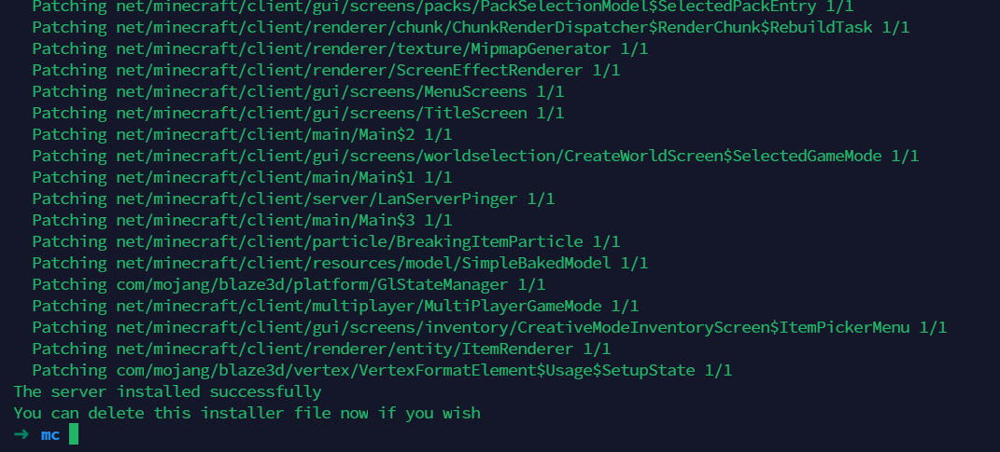
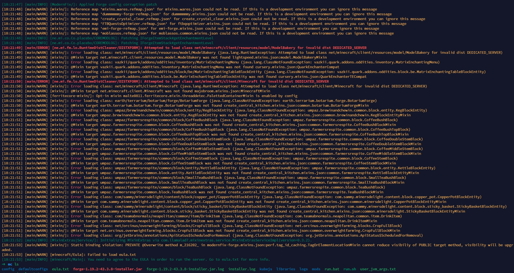
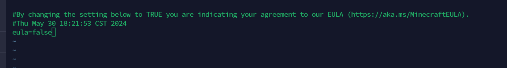
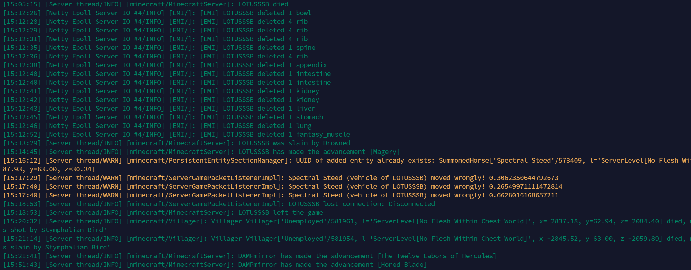
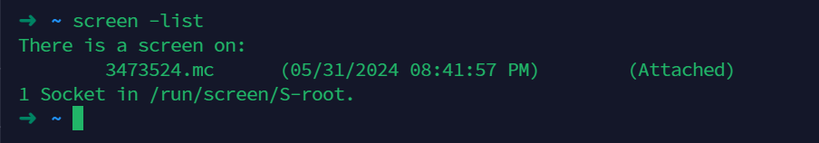

我这里购买的是雨云的7950x 4c10G的配置，安装了debian11系统

采用直接安装的方式安装


安装openjdk17
```sh
sudo apt install openjdk-17-jdk -y
```

安装screen以便不用一直挂着服务端

```sh
➜  / java -version 
openjdk version "1.8.0_352"
OpenJDK Runtime Environment (Alibaba Dragonwell Extended Edition 8.13.14) (build 1.8.0_352-b01)
OpenJDK 64-Bit Server VM (Alibaba Dragonwell Extended Edition 8.13.14) (build 25.352-b01, mixed mode)
```

java -jar forge-1.19.2-43.3.8-installer.jar nogui --installServer

➜  mc ls
config  defaultconfigs  forge-1.19.2-43.3.8-installer.jar  installer.log  kubejs  libraries  mods  run.bat  run.sh  user_jvm_args_backup.txt  user_jvm_args.txt
➜  mc 

执行java -jar文件安装forge-1.19.2-43.3.8-installer.jar 即可


随后启动run.sh文件，初次运行会生成eula.txt并且如果没有同意协议会无法启动


我们对eula文件进行修改，改为true后即可运行


正常启动后应该可以看到服务端的信息


这时候如果想退出ssh还能维持运行，就需要用到screen

执行
```sh
screen -S mc
```
创建一个名为mc的screen进程，再次启动你的mc即可

列出screen运行的进程
```sh
screen -list
```


重新进入screen进程
```sh
screen -r 'name'
```

