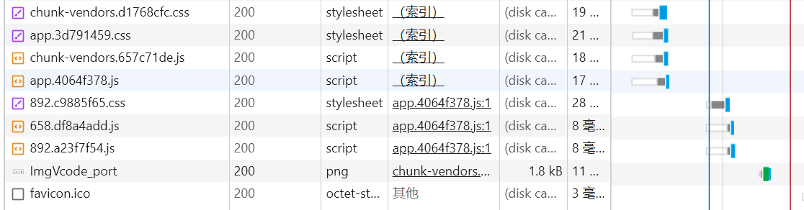

## 问题复现



在网络中，发现css和js都正常加载了，但是在实际加载的网页中，只有front正常加载，css和js


大概就是这种效果（悲

我的nginx配置文件如下：

```nginx
```bash
user nginx;
worker_processes auto;
error_log /folder/log/error.log;
pid /var/run/nginx.pid;

events {
    worker_connections 1024;
}

http{

server {
    listen 80;
    server_name test.example,com;

     location / {
          root   /folder/nginx/html/dist;
          index  index.html index.htm;
     }
```

## 寻求方法

### 权限问题?
一开始以为是静态文件static的权限问题，就在static文件夹下执行了`chmod -R 775 *`

### 正则表达式映射?

```nginx
location ~ ^/(?<dir>[^/]+)/(?<file>[^/]+)$ {
    gzip on;               
    alias /folder/nginx/html/dist/static/$dir/$file;
}
```

SO上的一个回答，据说在加入这个后正则表达式就能匹配到静态文件


### 浏览器的JS没开?

在Chrome中的隐私与安全大项下找到JavaScript，然后选择允许所有网站运行JavaScript


## 解决方法

结果当然是，上述的所有办法，都没有生效

最终发现，是因为我在nginx的配置中，没有开启mime type，导致浏览器无法识别css和js文件

```nginx
http{

    include mime.types;
    default_type application/octet-stream;

server {
```

## 总结

这算个常见问题吗，我觉得不算，

因为我在网上找了很久都没有找到解决方法，最后还是自己摸索出来的

可能因为这个问题也太蠢了(绷

也算是给自己的一个记录吧(笑


