# 区块链技术与应用

## 引言 
区块链不止是比特币，不要被比特币限制想象
1.1
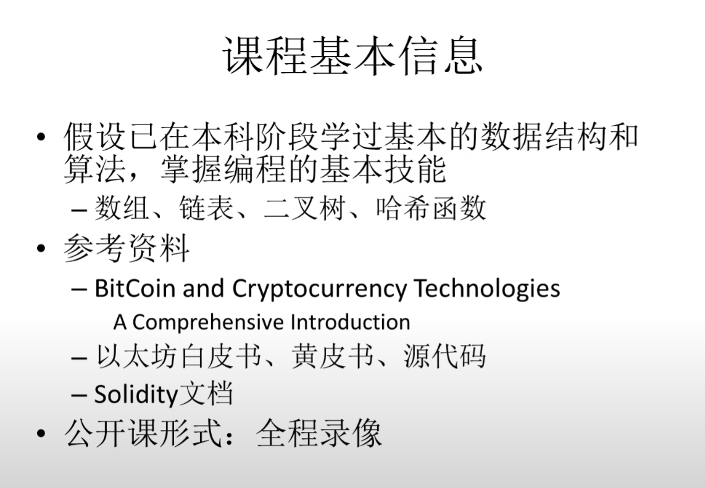

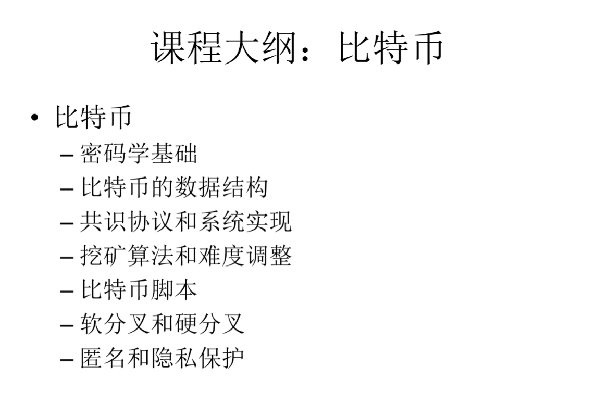

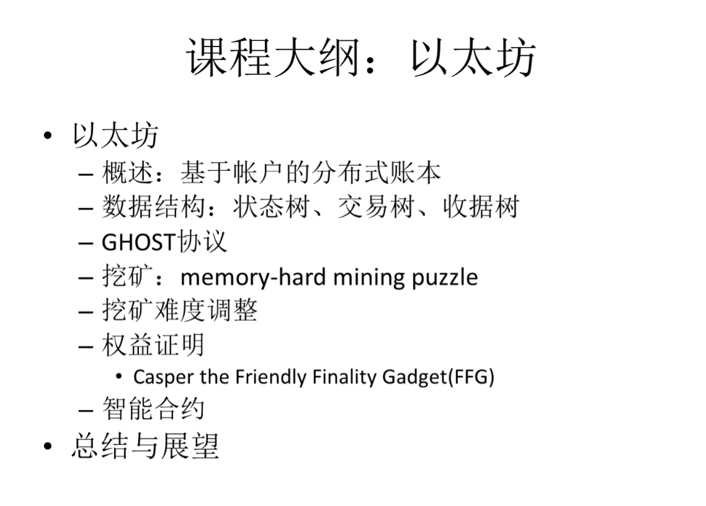

## BTC密码学原理

比特币被称为加密货币，但是加密货币是不加密的，区块链所有内容都是公开的，例如转账金额，账户地址

使用到两种哈希函数
- **cryptographic hash function**

- **collison resistance (哈希碰撞)**

哈希碰撞 ：x ! = y, H (x) = H (y)

一般来说，哈希碰撞是不可避免的，因为输入空间远大于输出空间（没有什么高效的方法使得哈希人为碰撞

**collison resistance的性质：找不到H(m') 与之相同**

H(m)  与  digest

**如果有人修改H(m),哈希值就会被修改**

没办法篡改内容而不被检测 (类似刷机时的检验md5值)(md5就是哈希的一种，不够已经不再安全了)

x 可以推出 H(x)，但是反之不行

- **hiding**：hash函数的计算过程是单向的，是不可逆的。给定一个输入X，可以计算其hash值 H(X)，但是通过H(X)，很难知道其输出为X。当然蛮力求解也是一个办法。hiding性质的前提是：（1）输入空间较大；（2）输入的分布比较分散。

- **digital commitment（digital equivalent of a sealed envelope）**：通过collision resistance和hiding的性质，就可以得到digital commitment这个性质。

举例：想要预测股市，但是又不能影响，只能把结果放在信封里面。

预测结果不能提前公开，就需要用到sealed envelope(密封信封)，把 x 算出的哈希值公布出去，因为有哈希hiding的性质，又有collison resistance的性质，就能做到预测股市但是又不影响

如果输入不满足hiding，常用把输如拼接随机数再哈希 **H( x || nonce)**

- **puzzle friendly**: 要想使得计算得到的hash值在某一个范围之内，则只能够一个一个的输入去尝试，很难直接找到某个值使得其hash值在某一个范围内。挖矿 也是就是这个意思。挖矿就是把区块中的一些信息+随机数进行hash，使得其结果前K位数为0，才能够满足要求。挖矿无捷径，只能够去大量的试。所以也就产生了 工作量证明（POW）。

### 工作量证明(POW)
就是做了大量的尝试之后，才得到符合要求的结果，这个过程叫做工作量证明。proof of work 

H(block header) <= target

**工作量证明的目的**：为了防止恶意节点篡改区块链的历史记录，需要让恶意节点付出巨大的代价，才能够篡改区块链的历史记录。

比特币用的函数是 SHA256
Secure Hash Algorithm 256
上面的性质都是满足的

签名

比特币中的账户管理
创立账户很简单，就是创立公钥(public key)和私钥(private key)的对

公私钥体系(非对称加密体系)(asymmetric cryptography)
好处-->公钥是不用保密的，私钥保存在本地就行，不需要传出去

万一两个人产生的公私钥对相同怎么办
疯狂产生私钥，直到产生一个不同的私钥。。？
理论上可以，实际上不可行，因为私钥的空间太大了，不可能产生相同的私钥

产生公私钥的时候，需要一个随机源，这个随机数就是私钥
a good source of randomness
比特币算法不仅有生成，还有好的随机源

## BTC的数据结构

### 哈希指针：指向一个哈希值的指针

一个最基本的数据结构就是区块链
区块链是一个链表，每个节点是一个区块
区块链跟普通的链表的不同，就是哈希指针代替了普通的指针
Block chain is a linked list with hash pointers
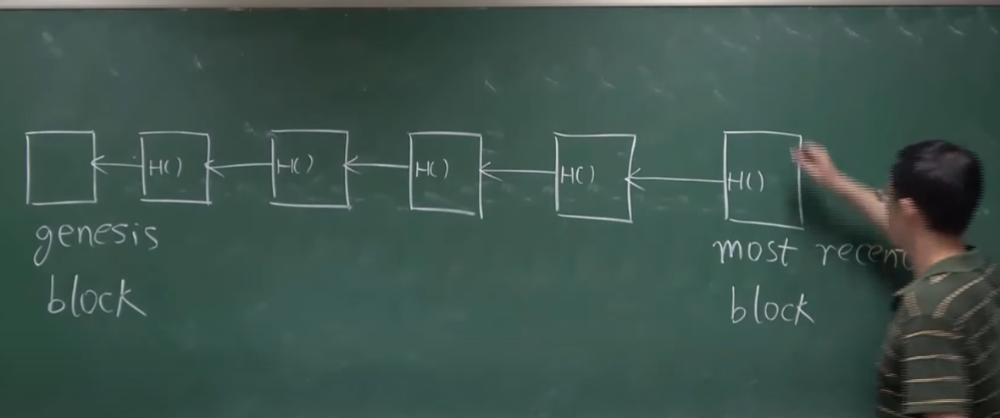

通过这样的数据结构
可以实现tamper-evident(篡改可见)
其中任意一个修改了，接下来都会变

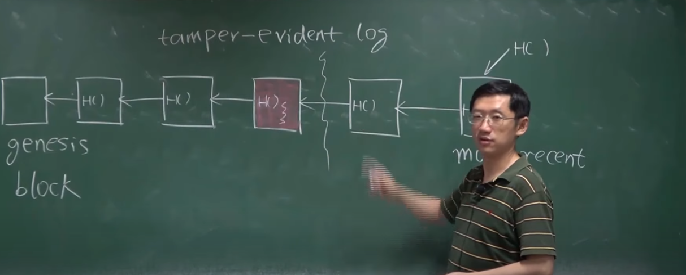

以分割线为主体，我怎么知道我的哈希值是不是对的呢，跟后面的哈希值比对就知道了

### Merkle tree轻节点

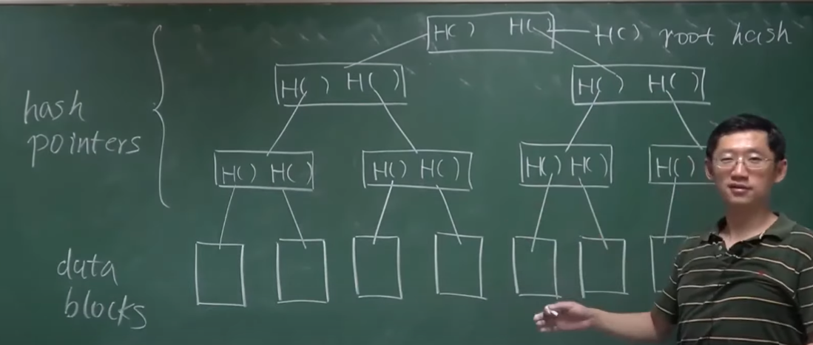
只要记录根节点的哈希值，就能够知道整个树的哈希值
这样保护了整棵树

### Merkle proof

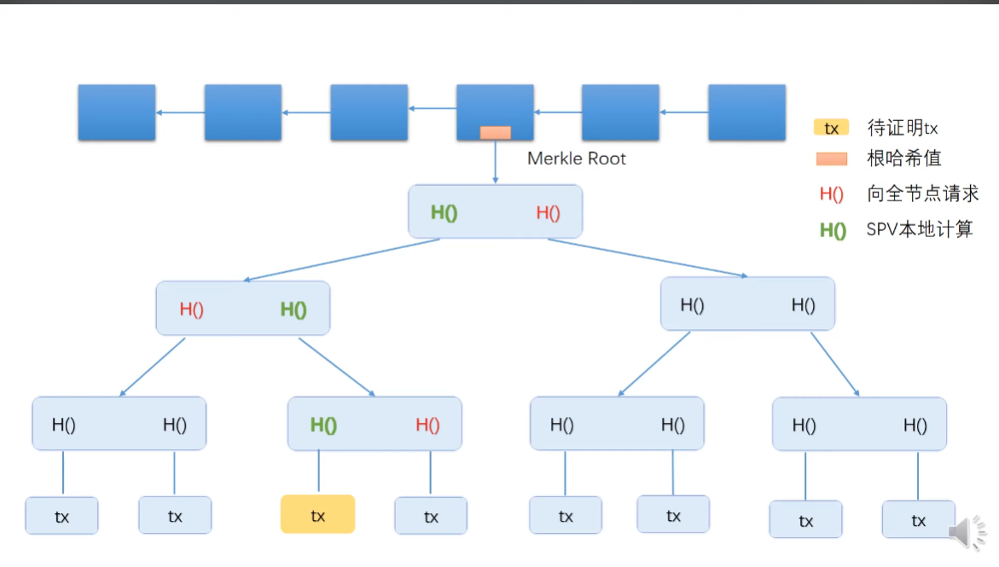

绿色和红色的相结合能一级一级证明

Sorted Merkle tree
排序的tree（？

除了循环链表都能用哈希指针

## BTC协议

如何设计出一个币
假如大家都有一个信任的中心化系统

数字货币跟纸质货币的区别
double spending attack(双花)
数字货币最主要防范的攻击

要维护一个表，记录每个币的状态（中心化的方案

### BTC解决问题：提出了一个去中心化的方案
两个问题
货币的发行问题：

防范double spending attack

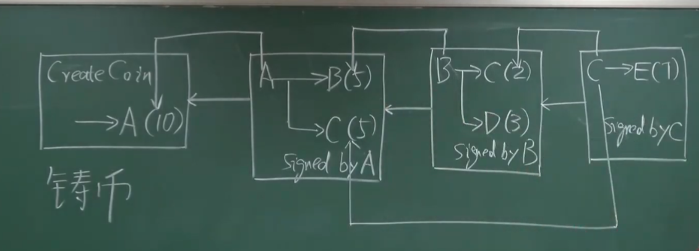

每一个交易都是一个输入和一个输出
可以防范双花攻击

### Block header 区块头
version 版本信息，比特币哪个版本
hash of previous block header 区块链中指向前一个区块的指针
merkle root hash  merkle根哈希值
target  挖矿难度目标阈值
nanonce 随机数

### Block body 区块体
transaction list 交易列表

full node(fully validating node) 全节点
light node 轻节点

账本的内容要取得分布式共识
distributed consensus 账本的内容要取得分布式共识
distributed hash table 分布式哈希表
impossible result FLP 
asynchronous network 异步网络
faulty 
CAP Theorem
Consistency 一致性
Availability 可用性
Partition tolerance 分区容错性

### Consensus in BitCorn 比特币中的共识协议

#### membership 投票权
sybil attack 虚假身份攻击(女巫攻击)
简单的投票不行，因为有虚假身份攻击(别人不知道你是谁)，所以需要工作量证明(POW)

接受的区块是最长的链longest valid chain
forking attack 分叉攻击
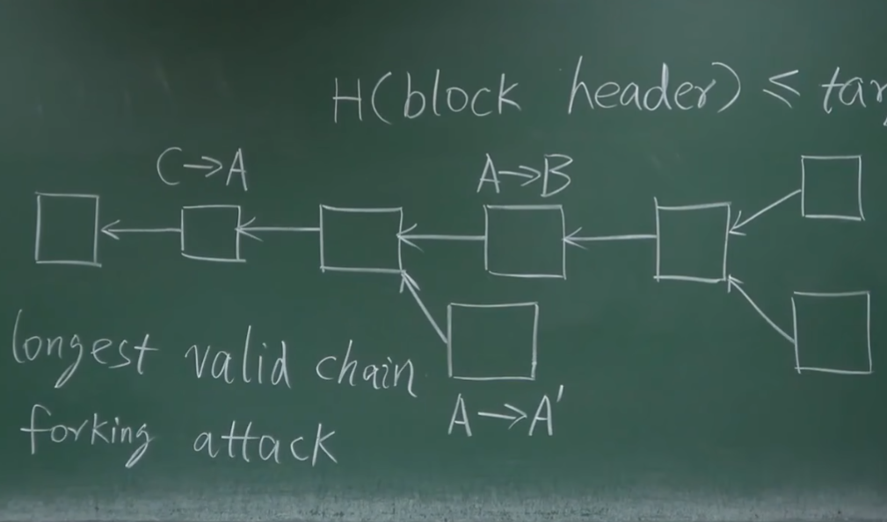

#### 记账权
获得记账权绝对哪些区块可以写到下个节点，但是设计权益的时候，不应该让这个成为争夺记账权的主要动力(我们希望合法的交易都写到区块链里面)

巧妙的机制:block reward 区块奖励
coninbase transaction **发行**新的比特币的方法(凭空造出来的)
每个区块奖励50个比特币，21w个区块之后减半

#### mining 挖矿
挖矿的目的是为了获得记账权

## BTC实现

### transaction-base ledger 交易型账本
比特币全节点维护一个叫UTXO的数据结构(unspent transaction output 未花费的交易输出)

total inputs = total outputs
有时候不是相等的，因为有手续费，手续费是给矿工的

比特币的奖励机制：
transaction fee 交易费

挖矿主要是拿出块奖励

比特币被设计为每隔十分钟产生一个新的区块

（21万*10分钟）/（60分钟*24小时*365天）
也就是平均每四年（出块奖励）减半

### account-base ledger 账户型账本(ETH的模式)

账户型，系统要显示每个账户有多少币

比特币做交易需要说明这个币的来源，以太坊就不需要

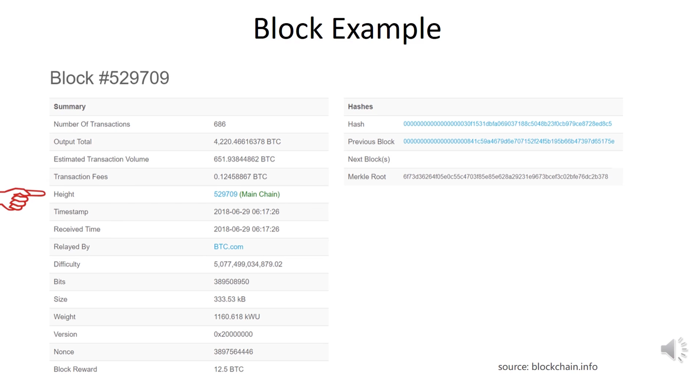

每次挖矿可以看作是Bernoulli trial
Bernoulli trial:a random experiment with binary outcome 伯努利试验(二项分布(扔硬币))

每个Bernoulli trial构成了Bernoulli process
Bernoulli process: a sequence of independent Bernoulli trials 伯努利过程

Bernoulli trial特性是无记忆性
memoryless property: the probability of the next outcome is independent of the past outcomes 无记忆性

Poisson process 泊松过程

区块时间符合 xponential distribution 指数分布

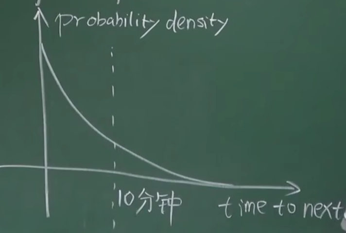

虽然平均出块是10分钟，但是不是10分钟没挖到，过一会就能出，他是符合这个指数分布的，
也就是说，将来还要挖多少时间，他都是符合这个分布的（Poisson process 泊松过程）

Q:如果不是Poisson process 泊松过程，会出现怎样？
A:算力强的矿工会有很大优势，算力强的矿工过去做的工作是多的

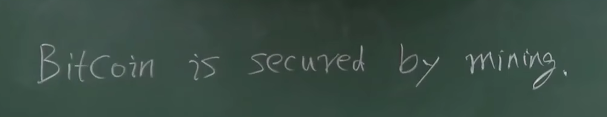

Q:如果有90%的算力在诚实矿工手里，10%在坏矿工手里，他能偷币吗
A:不能，他无法伪造签名

假设M节点是恶意的

诚实的节点会沿着m前的区块继续挖，而不是接着m

对于m是很难受的，因为的他消耗了挖出这个区块的算力

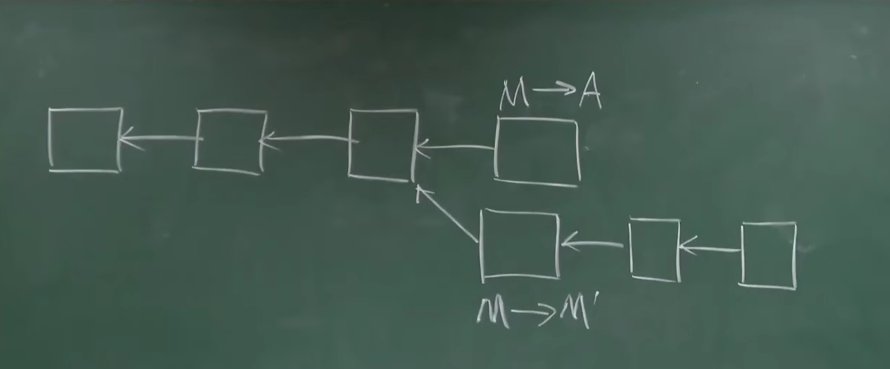
Q:如何防范m到a转账后，又有另外一条链把m花出去的钱收回来呢（double spending attack）
A:在转账后面跟好几个区块（多等几个区块，多等几个确认）
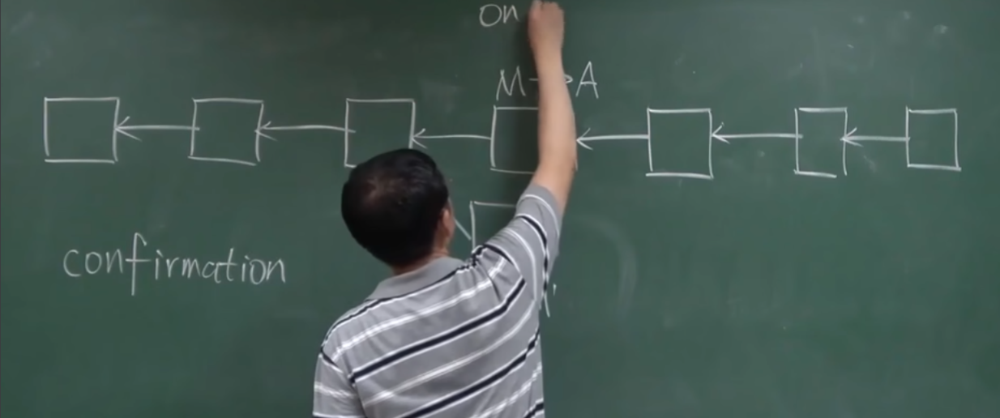

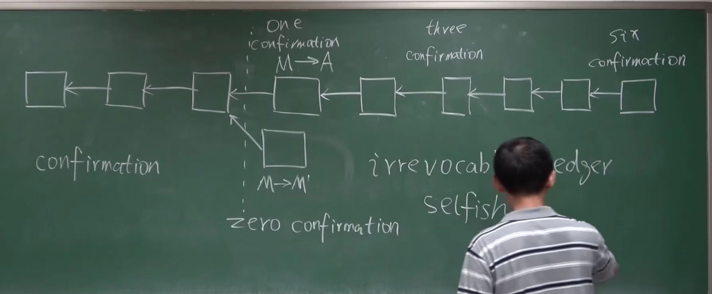

如果他确认需要6个区块，我偷偷在下面挖，等到他6个区块结束的时候，我公布我的7个区块，这样也能达成攻击
这种攻击叫做selfish mining attack 自私挖矿攻击
前提:有恶意的节点占据更多的算力

Q:除了forking attack,selfish mining还能做什么
A:让别人做无用功😆

## BTC网络

btc1是p2p的网络

application layer:Bitcoin Block chain
----------------------------------------
network layer:  P2P Overlay Network

节点间通过tcp通信（利于穿过防火墙）

btc网络设计原则: simple,robust（耐艹）,but not effictive

消息传播在网络中采取叫flooding的方式

对区块大小有限制：1M

btc传播属于best effort

## 挖矿难度

挖矿时间简短，增加出块速度，不是好事吗？

Q:出块时间短，会发送什么？
A:比如不到1s就出块，btc网络可能需要很久才能传递这个区块，如果别的区块差不多也出了一个区块，这会形成分叉，出块时间越短，分叉会越来越多，会影响安全性

Q:出块不是越短越好，那10分钟就最好吗？
A:不是

//以太坊设计了一个新的协议ghost

无论出块时间设置为多长，都需要不断调整难度，来保证出块时间的稳定

Q:怎么调整挖矿难度?
A:随target和actual time和expected time变化

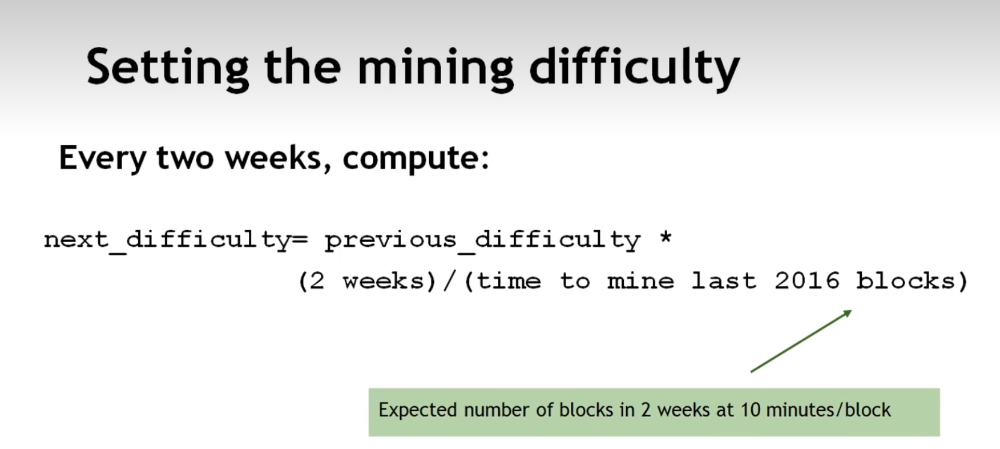

## 挖矿

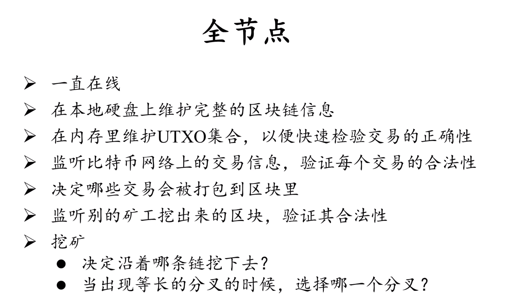

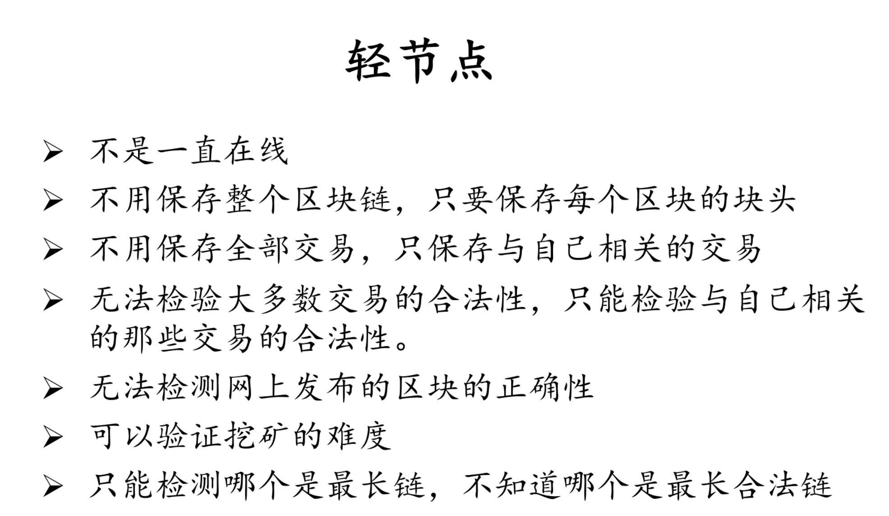

比特币安全性的保证:密码学和共识机制（好矿工）

现在挖矿的主要手段: ASIC=Application-specific integrated circuit(专用集成电路)

挖矿的另一个趋势：大矿工（矿池）

单个矿工还需要承担全节点的责任，所以引入矿池

矿池有一个管理者pool manager
有n个miner，miner负责计算hash值

Q:收益该如何分配？
A:通过矿池特定的通讯协议，依靠矿工的pow分配

Q:如果有个矿池占到了51%以上的算力，能发动什么攻击呢
A:最常见为分叉攻击（坏节点获得记账权）

## BTC脚本

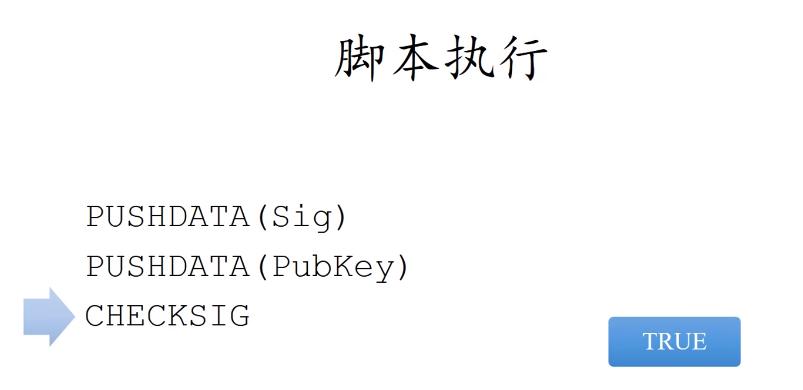

不断把数据压入栈

## 分叉

state fork 

deliberate fork

protocd fork

硬分叉和软分叉、

soft：

hard fork:
所有的系统都必须更新软件，否则不能接入节点
硬分叉的一个例子：区块大小 block size limit

P2SH

